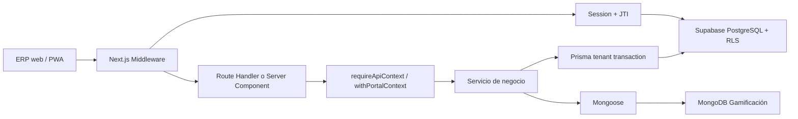
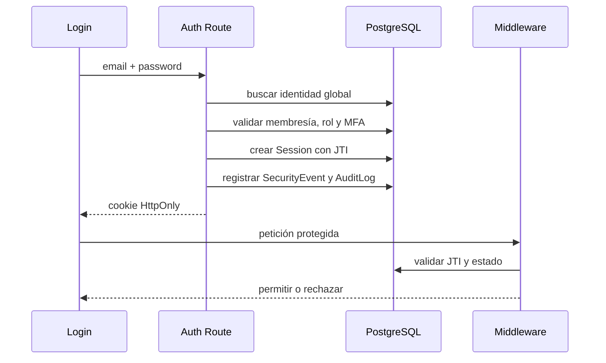

# The-Tower-Power-ERP: Arquitectura Backend y Guía de Integración Frontend

**Nombre anterior:** Gerpy

**Estado:** línea base técnica para integración

**Última actualización:** 29 de julio de 2026

**Audiencia:** estudiantes, desarrolladores frontend/backend, QA y responsables de despliegue

## Propósito

Este documento explica cómo funciona el backend multi-tenant de
The-Tower-Power-ERP y define las reglas que debe respetar el frontend. Su
objetivo es evitar fugas de información, escaladas de privilegios, consultas
cross-tenant, sesiones inconsistentes y sobrecarga de PostgreSQL o MongoDB.

Las reglas no negociables son:

1. El `tenantId` autorizado siempre procede de la sesión validada.
2. El frontend nunca decide qué permisos tiene un usuario.
3. El frontend nunca se conecta directamente a PostgreSQL o MongoDB.
4. Las operaciones PostgreSQL tenant-scoped se ejecutan con contexto RLS.
5. Las consultas MongoDB siempre incluyen `tenantId` y el identificador del
   miembro obtenido por el backend.
6. Una comprobación visual de permisos mejora la UX, pero nunca reemplaza al
   guard del endpoint.
7. Las credenciales, cookies HttpOnly y claves `service_role` no se exponen al
   navegador.

---

# PARTE 1: Arquitectura Backend

## 1. Topología del Sistema

### 1.1 Componentes principales

| Componente | Tecnología | Responsabilidad |
| --- | --- | --- |
| ERP web y portal PWA | Next.js App Router, React y TypeScript | Vistas, Server Components, Client Components y navegación |
| Frontera HTTP | `middleware.ts` y Route Handlers | Sesión, tenant, internacionalización y protección de rutas |
| Autorización | RBAC y guards centralizados | Módulos, permisos, scopes y sucursales |
| Acceso relacional | Prisma ORM y `@prisma/adapter-pg` | Consultas, migraciones y transacciones |
| Base transaccional | Supabase PostgreSQL | Usuarios, tenants, finanzas, inventario, nómina, sesiones y auditoría |
| Aislamiento final | PostgreSQL Row-Level Security | Rechazo de filas pertenecientes a otro tenant |
| Gamificación | MongoDB y Mongoose | Mediciones, puntos XP, rangos y equipos |
| Autenticación | Auth.js/NextAuth y sesión propia con JWT | Login, OAuth, JTI, revocación, MFA y cookies seguras |
| Calidad | Playwright y Node Test Runner | E2E, integración, aislamiento y regresión |

### 1.2 Diagrama de alto nivel



El navegador solo se comunica con Next.js. Prisma, la cadena de conexión de
Supabase, Mongoose y `MONGODB_URI` permanecen en el servidor.

### 1.3 Ciclo de una petición protegida

1. El navegador envía la cookie de sesión HttpOnly.
2. `middleware.ts` valida la firma, expiración y JTI.
3. El middleware obtiene `userId`, `tenantId`, `branchId`, scopes, módulos y
   permisos del token validado.
4. Un header `x-tenant-id` enviado por el cliente se usa únicamente para
   detectar discrepancias. Nunca sustituye al tenant de la sesión.
5. `requireApiContext()` vuelve a resolver el contexto contra la base de
   datos para descartar membresías, roles o sesiones revocadas.
6. El guard comprueba módulo, permiso y sucursal.
7. El servicio ejecuta la lógica de negocio.
8. Las consultas sensibles usan `withTenantTransaction()` para activar RLS.
9. El endpoint devuelve un contrato uniforme:
   `{ ok: true, data }` o `{ ok: false, error, message }`.

Esta defensa por capas evita que una omisión aislada entregue datos de otra
organización.

## 2. Multi-tenancy y Seguridad

### 2.1 Identidad global y pertenencia

`User` es una identidad global y no contiene `tenantId`. La pertenencia se
modela por separado:

| Modelo | Función |
| --- | --- |
| `Tenant` | Empresa u organización propietaria de los datos |
| `Branch` | Sucursal perteneciente a un tenant |
| `TenantMembership` | Vínculo vigente entre `User` y `Tenant` |
| `BranchMembership` | Sucursales a las que puede acceder la membresía |
| `Role` | Conjunto de permisos con scope definido |
| `RoleAssignment` | Rol vigente asignado a una membresía y, opcionalmente, sucursal |
| `Permission` | Capacidad granular, por ejemplo `payroll.pay` |

Las claves compuestas repiten `tenantId` en relaciones sensibles. Esto impide
que Prisma cree una referencia válida entre una membresía del Tenant A y un
rol o sucursal del Tenant B.

### 2.2 Capas de aislamiento

El aislamiento no depende de un único filtro:

| Capa | Control |
| --- | --- |
| Sesión | Contiene el tenant activo y una lista de sucursales autorizadas |
| Middleware | Rechaza sesiones inválidas y headers tenant discrepantes |
| Guard | Comprueba membresía, módulo, permiso y sucursal |
| Servicio | Incluye `tenantId` y, cuando aplica, `branchId` en la consulta |
| Prisma | Usa relaciones y claves compuestas multi-tenant |
| PostgreSQL | RLS impide leer o escribir filas de otro tenant |

> **SEGURIDAD:** un `where: { id }` aislado no es suficiente para una entidad
> multi-tenant. Debe existir contexto RLS y, cuando el modelo lo permita, una
> condición explícita por `tenantId`.

### 2.3 Row-Level Security en Supabase

`prisma/rls.sql` crea `private.current_tenant_id()`. Esta función lee:

`current_setting('app.current_tenant_id', true)`.

Las políticas tenant-scoped aplican:

- `USING` para limitar `SELECT`, `UPDATE` y `DELETE`.
- `WITH CHECK` para impedir `INSERT` o `UPDATE` con otro tenant.
- `ENABLE ROW LEVEL SECURITY` y `FORCE ROW LEVEL SECURITY`.
- Acceso append-only para `AuditLog` y `SecurityEvent`.
- Acceso a identidades globales mediante una membresía del tenant activo.
- Acceso a `RolePermission` mediante el tenant propietario del rol.

`lib/db/prisma.ts` establece el contexto dentro de la misma transacción:

```ts
import { withTenantTransaction } from "@/lib/db/prisma";

export async function listTenantMembers(tenantId: string, branchId: string) {
  return withTenantTransaction(tenantId, (tx) =>
    tx.member.findMany({
      where: {
        tenantId,
        branchId,
        status: "ACTIVE",
      },
      orderBy: { createdAt: "desc" },
    }),
  );
}
```

Internamente, la transacción:

1. Ejecuta `SET LOCAL ROLE authenticated`.
2. Define `app.current_tenant_id`.
3. Comprueba que el valor quedó establecido.
4. Ejecuta Prisma en esa misma conexión.
5. Descarta el contexto al hacer commit o rollback.

### 2.4 Roles de conexión PostgreSQL

El rol operativo `authenticated` no debe tener `BYPASSRLS`.

El rol `service_role` se reserva para autenticación y bootstrap controlado.
La migración de autenticación exige que ese rol tenga `BYPASSRLS` antes de
conceder lecturas mínimas sobre usuarios, membresías, roles y permisos. No se
crea una política pública permisiva para login.

> **PROHIBIDO:** publicar la contraseña de `DATABASE_URL`, una clave
> `service_role` o una variable equivalente con prefijo `NEXT_PUBLIC_`.

Supabase aloja PostgreSQL, pero la aplicación no depende de `auth.uid()` para
el aislamiento. NextAuth valida la identidad y el backend instala el tenant
activo mediante `app.current_tenant_id`.

### 2.5 Aislamiento por sucursal

RLS protege la frontera entre tenants. La frontera entre sucursales del mismo
tenant se aplica mediante:

- `BranchMembership` vigente.
- `RoleAssignment` con scope `BRANCH`.
- `branchIds` y `branchId` de la sesión.
- `requireBranchAccess()`.
- Consultas que combinan `tenantId` y `branchId`.

Actualmente no existe `app.current_branch_id` en PostgreSQL. Por eso una
consulta de sucursal debe mantener tanto el guard de aplicación como el
filtro explícito.

### 2.6 Plantilla de endpoint seguro

```ts
import { NextRequest } from "next/server";
import { z } from "zod";

import { requireApiContext } from "@/lib/api/context";
import { created, fail } from "@/lib/api/response";
import { withTenantTransaction } from "@/lib/db/prisma";

const CreateInput = z.object({
  branchId: z.string().trim().min(1),
  name: z.string().trim().min(2).max(120),
});

export async function POST(request: NextRequest) {
  try {
    const input = CreateInput.parse(await request.json());
    const context = await requireApiContext({
      moduleId: "inventory",
      permission: "inventory.write",
      branchId: input.branchId,
    });

    const data = await withTenantTransaction(context.tenantId, (tx) =>
      tx.warehouse.create({
        data: {
          tenantId: context.tenantId,
          branchId: input.branchId,
          name: input.name,
        },
      }),
    );

    return created(data);
  } catch (error) {
    return fail(error);
  }
}
```

El body no acepta `tenantId`. Aunque el cliente lo enviara, el backend debe
ignorarlo y usar `context.tenantId`.

## 3. Autenticación y RBAC

### 3.1 Fuentes de sesión

El backend soporta dos entradas que terminan en un contexto común:

- Auth.js/NextAuth para Credentials y proveedores OAuth.
- El login propio `POST /api/auth/login`, que emite
  `tower_power_session`.

Ambos flujos usan JWT, JTI persistido y una vigencia máxima de ocho horas.
`requireApiContext()` intenta primero la sesión propia y usa NextAuth como
fallback.

El navegador no debe decodificar ninguna cookie. Son HttpOnly para reducir el
impacto de XSS.

### 3.2 Flujo de login



Una sesión deja de ser válida cuando:

- `isRevoked` es `true`.
- Expiró.
- El JTI no existe.
- El usuario, tenant o token no coinciden.
- El usuario o la membresía dejaron de estar activos.
- Un logout o cambio de autorización revocó la sesión.

### 3.3 Auditoría de seguridad

`SecurityEvent` registra:

- Login exitoso o fallido.
- Logout.
- Bloqueo.
- Cambio de contraseña.
- Desafíos MFA fallidos.
- Revocación de sesión.

`AuditLog` registra actor, tenant, sucursal, acción, entidad, valores
anteriores/nuevos, IP y `correlationId`. Para el rol operativo estas tablas
son append-only.

El login limita cada IP a cinco intentos por minuto. El sexto responde
`429 Too Many Requests`. El limitador actual es por instancia y deberá
migrarse a Redis/KV si se escala horizontalmente.

### 3.4 Modelo RBAC

`RoleScope` define:

| Scope | Alcance |
| --- | --- |
| `SYSTEM` | Administración global permitida solo en rutas declaradas |
| `TENANT` | Operación consolidada dentro de una empresa |
| `BRANCH` | Operación limitada a una sucursal autorizada |

`getTenantContext()`:

1. Selecciona una `TenantMembership` activa.
2. Descarta membresías de tenants inactivos.
3. Obtiene `BranchMembership` vigente.
4. Descarta roles revocados, futuros o expirados.
5. Aplica roles `BRANCH` solo a la sucursal activa.
6. Aplana permisos y módulos sin duplicados.

Los permisos son capacidades, no nombres decorativos. Ejemplos:

- `inventory.read`
- `inventory.write`
- `hr.employee.write`
- `payroll.approve`
- `payroll.pay`
- `accounting.journal.write`

`lib/api/module-access.ts` vincula método y ruta con el permiso mínimo.
`lib/api/context.ts` es el guard central. No se debe crear un segundo sistema
de autorización dentro de componentes o Route Handlers.

### 3.5 Superadministración

Un rol `SYSTEM` puede operar sin tenant únicamente en rutas administrativas
marcadas con `allowSystemWithoutTenant`. No es un bypass general para
inventario, nómina, contabilidad ni portal de socios.

## 4. Estrategia Dual de Base de Datos

### 4.1 PostgreSQL como fuente transaccional

Supabase PostgreSQL almacena:

- Identidad, membresías, roles y permisos.
- Sesiones, MFA, invitaciones y auditoría.
- Tenants, sucursales y configuración.
- Miembros, suscripciones y reservas.
- Inventario, ventas, nómina y contabilidad.
- Notificaciones, Outbox e idempotencia.

Estas áreas requieren integridad referencial, transacciones ACID, restricciones
únicas, claves compuestas y RLS.

### 4.2 MongoDB para gamificación

MongoDB almacena documentos de alta variabilidad:

| Colección | Contenido |
| --- | --- |
| `member_progress` | Historial de peso, grasa corporal y masa muscular |
| `member_points_ledger` | Movimientos inmutables de XP |
| `member_groups` | Equipos y miembros asociados |

La identidad oficial del usuario y del miembro continúa en PostgreSQL.
MongoDB recibe los identificadores ya autorizados por el backend.

MongoDB no proporciona las políticas RLS de PostgreSQL. Su aislamiento se
implementa en `lib/portal/context.ts` y `lib/portal/service.ts`:

1. Se valida la sesión.
2. Se resuelve el tenant por `tenantSlug`.
3. Se exige `TenantMembership`, rol `MEMBER` y `BranchMembership` vigentes.
4. Se obtiene `tenantId` y `memberId` del contexto autorizado.
5. Cada filtro Mongoose incluye ambos identificadores.

```ts
const progress = await MemberProgress.findOne({
  tenantId: context.tenantId,
  memberId: context.memberId,
})
  .lean()
  .exec();
```

El navegador no envía `memberId` para decidir qué documento leer.

### 4.3 Integridad y concurrencia de XP

`member_points_ledger` tiene:

- Índice por `tenantId`, `memberId` y fecha.
- Índice único y sparse por `tenantId` y `sourceEventId`.
- Límite de puntos por movimiento.
- Fecha de ocurrencia inmutable.

`sourceEventId` permite que un evento de negocio se procese una sola vez. Un
botón del frontend no debe incrementar XP directamente ni repetir una
mutación hasta que el número cambie.

### 4.4 Consistencia entre bases

No existe una transacción distribuida entre PostgreSQL y MongoDB. Por eso:

- PostgreSQL mantiene la identidad y el evento de negocio oficial.
- MongoDB proyecta progreso y gamificación.
- Los procesos que deban escribir en ambas bases deben usar un evento
  idempotente, idealmente mediante Outbox.
- Una falla de MongoDB no debe alterar saldos, nómina, reservas ni permisos en
  PostgreSQL.
- Los registros financieros nunca se almacenan únicamente en MongoDB.

### 4.5 Degradación del portal

Si `MONGODB_URI` no está configurado, las lecturas de progreso retornan un
estado vacío seguro y las escrituras responden `503 MONGO_UNAVAILABLE`.
El frontend debe mostrar el resto del portal y degradar solo el widget de
gamificación.

## 5. Procesos Backend Relevantes

### 5.1 Nómina a contabilidad

`POST /api/payroll/periods/[periodId]/pay` exige `payroll.pay`. El servicio:

1. Comprueba tenant y cuentas.
2. Verifica que la nómina esté aprobada.
3. Calcula cargos y abonos.
4. Exige cuadratura.
5. Marca la nómina como pagada y crea el asiento en una transacción.
6. Usa `@@unique([tenantId, sourceType, sourceId])` para idempotencia.

Una repetición válida responde `409 PAYROLL_ALREADY_PROCESSED` sin crear un
segundo asiento.

### 5.2 Outbox y webhooks

Los efectos externos usan Outbox:

`PENDING -> PROCESSING -> PROCESSED`

Los fallos recuperables vuelven a `PENDING` con backoff. Después del máximo
de intentos pasan a `FAILED`. El worker usa claim atómico, lease y
`FOR UPDATE SKIP LOCKED`.

Los webhooks usan HMAC-SHA256, timestamp, comparación constante y clave de
idempotencia. `vercel.json` ejecuta el worker cada minuto mediante cron.

## 6. Mapa de Implementación

| Área | Archivo |
| --- | --- |
| Modelo relacional | `prisma/schema.prisma` |
| RLS general | `prisma/rls.sql` |
| Transacción tenant-scoped | `lib/db/prisma.ts` |
| Resolución RBAC | `lib/auth/tenant-context.ts` |
| Guard de API | `lib/api/context.ts` |
| Permisos por ruta | `lib/api/module-access.ts` |
| Middleware | `middleware.ts` |
| NextAuth | `auth.ts` |
| JTI y auditoría | `lib/auth/session.ts` |
| Contexto del portal | `lib/portal/context.ts` |
| PostgreSQL y MongoDB del portal | `lib/portal/service.ts` |
| Modelos MongoDB | `lib/db/mongo-models.ts` |
| API de progreso | `app/api/client/progress/route.ts` |
| Manifiesto PWA | `app/[locale]/portal/[tenantSlug]/manifest.webmanifest/route.ts` |
| Service Worker | `app/sw.js/route.ts` |
| E2E | `tests/` |

---

# PARTE 2: Reglas Estrictas para Frontend

## 7. Mandamientos del Frontend

### Mandamiento 1: no inventarás el tenant

Nunca se debe:

- Hardcodear un tenant.
- Guardar `tenantId` en `localStorage`.
- Obtenerlo de un input oculto.
- Confiar en un query param como fuente de autorización.
- Cambiarlo mediante DevTools.
- Decodificar manualmente la cookie o el JWT.

El `tenantSlug` de una URL sirve para localizar el portal. El backend lo
compara con la membresía autenticada; no concede acceso por sí solo.

### Mandamiento 2: usarás la sesión tipada

En pantallas respaldadas por Auth.js, la sesión se consume con
`useSession()`:

```tsx
"use client";

import { useSession } from "next-auth/react";

export function usePayrollAccess() {
  const { data: session, status } = useSession();

  if (status === "loading") return null;
  if (!session?.user.tenantId) return null;

  const canRead = session.user.permissions.includes("payroll.read");
  const canPay = session.user.permissions.includes("payroll.pay");

  return {
    tenantId: session.user.tenantId,
    branchId: session.user.branchId,
    canRead,
    canPay,
  };
}
```

Reglas:

- Usar `permissions`, no `session.user.role === "ADMIN"`.
- Usar `roleScopes.includes("SYSTEM")` solo para adaptar vistas de
  superadministración.
- Tratar `tenantId`, `roles` y `permissions` como valores de solo lectura.
- No usar un permiso visual como prueba de autorización.

El contrato TypeScript usa `tenantId`, no `tenant_id`, y expone `roles` como
arreglo. No existe un `session.user.role` autoritativo.

`useSession()` requiere un `SessionProvider`. No se debe montar un provider
paralelo en una ruta cuyo login activo usa la cookie propia, porque produciría
dos estados de autenticación distintos.

El proyecto también mantiene una cookie propia HttpOnly. En layouts que usan
esa sesión, el contexto se resuelve en un Server Component y se entrega al
cliente como un view model mínimo:

```tsx
import { getTenantContextFromCookies } from "@/lib/auth/server-session";

import { AccountClient } from "./account-client";

export default async function AccountPage() {
  const context = await getTenantContextFromCookies();

  if (!context?.tenantId) return null;

  return (
    <AccountClient
      viewer={{
        branchId: context.branchId ?? null,
        permissions: context.permissions,
      }}
    />
  );
}
```

No se debe importar `getTenantContextFromCookies()` en un Client Component.

### Mandamiento 3: no enviarás autoridad inventada en headers

Para rutas same-origin, usar URLs relativas y cookies:

```ts
type ApiSuccess<T> = {
  ok: true;
  data: T;
};

type ApiFailure = {
  ok: false;
  error: string;
  message?: string;
};

export class ApiClientError extends Error {
  constructor(
    public readonly status: number,
    public readonly code: string,
    message: string,
  ) {
    super(message);
  }
}

export async function apiFetch<T>(
  path: string,
  init: RequestInit = {},
): Promise<T> {
  const headers = new Headers(init.headers);
  headers.set("Accept", "application/json");
  headers.set("x-correlation-id", crypto.randomUUID());

  const response = await fetch(path, {
    ...init,
    credentials: "include",
    cache: "no-store",
    headers,
  });

  const payload = (await response.json().catch(() => null)) as
    | ApiSuccess<T>
    | ApiFailure
    | null;

  if (!response.ok || !payload?.ok) {
    const failure = payload as ApiFailure | null;
    throw new ApiClientError(
      response.status,
      failure?.error ?? "INVALID_RESPONSE",
      failure?.message ?? "No fue posible completar la operación.",
    );
  }

  return payload.data;
}
```

No enviar `x-tenant-id` desde el navegador. El middleware lo deriva de la
sesión. Si un cliente legado todavía lo requiere, debe proceder de
`session.user.tenantId` y cualquier discrepancia será rechazada.

El frontend nunca debe enviar:

```ts
const unsafeHeaders = {
  "x-tenant-id": "tenant-elegido-en-el-navegador",
  "x-user-role": "SUPERADMIN",
  "x-system-admin": "true",
};
```

Esos valores no conceden acceso y pueden provocar `403 TENANT_MISMATCH`.

### Mandamiento 4: respetarás la sucursal activa

Un `branchId` solo puede proceder de:

- `session.user.branchId`.
- `session.user.branchIds`.
- Una lista de sucursales devuelta por un endpoint protegido.

Antes de enviar una operación de sucursal:

```ts
export function assertAllowedBranch(
  branchId: string,
  allowedBranchIds: string[],
) {
  if (!allowedBranchIds.includes(branchId)) {
    throw new Error("BRANCH_NOT_AVAILABLE");
  }
}
```

Esta comprobación evita una mala UX, pero el backend volverá a ejecutar
`requireBranchAccess()`.

### Mandamiento 5: comprobarás siempre `response.ok`

Nunca asumir que `fetch()` lanza una excepción por `403` o `500`. No lo hace.
Usar el helper tipado y manejar estados:

| Estado | Acción de UI |
| --- | --- |
| `400` | Mostrar los campos inválidos |
| `401` | Redirigir a login conservando `next` |
| `403` | Mostrar permisos insuficientes; no reintentar automáticamente |
| `404` | Mostrar recurso no disponible |
| `409` | Mostrar conflicto o resultado ya procesado |
| `429` | Deshabilitar temporalmente y respetar `Retry-After` |
| `500`/`503` | Mantener la pantalla estable y ofrecer reintento manual |

```ts
export function userMessage(error: ApiClientError) {
  if (error.status === 401) return "Tu sesión expiró. Inicia sesión nuevamente.";
  if (error.status === 403) return "No tienes permisos para esta operación.";
  if (error.status === 409) return "La operación ya fue procesada.";
  if (error.status === 429) return "Hay demasiados intentos. Espera un momento.";

  return "El servicio no está disponible temporalmente.";
}
```

No mostrar al usuario stack traces, SQL, nombres de tablas, `EACCES`,
`DriverAdapterError` ni secretos. Registrar el `correlationId` en telemetría
para diagnóstico.

### Mandamiento 6: deshabilitarás mutaciones en vuelo

Una acción financiera o de reserva no debe enviarse dos veces:

```tsx
"use client";

import { useState } from "react";

export function useSafePayrollAction(periodId: string) {
  const [isPending, setIsPending] = useState(false);

  async function execute() {
    if (isPending) return;
    setIsPending(true);

    try {
      await apiFetch(`/api/payroll/periods/${encodeURIComponent(periodId)}/pay`, {
        method: "POST",
      });
    } finally {
      setIsPending(false);
    }
  }

  return { execute, isPending };
}
```

El backend conserva la idempotencia real. `isPending` solo evita clics
accidentales.

### Mandamiento 7: no conectarás el navegador a las bases de datos

Está prohibido en Client Components:

- Importar `@prisma/client`.
- Importar `mongoose`.
- Usar `DATABASE_URL` o `MONGODB_URI`.
- Usar una clave Supabase `service_role`.
- Consultar una colección MongoDB desde el navegador.
- Escribir XP enviando un `userId` elegido por el cliente.

El único camino permitido es:

`Componente -> Route Handler/Server Action -> guard -> servicio -> base`.

### Mandamiento 8: consultarás gamificación con moderación

El proyecto no incluye SWR ni React Query. No se debe añadir una dependencia
sin aprobación. Para una lectura puntual puede usarse un hook local:

```tsx
"use client";

import { useCallback, useEffect, useState } from "react";

type PortalProgress = {
  points: number;
  level: string;
  nextLevelPoints: number;
  history: Array<{
    date: string;
    weight: number | null;
    bodyFat: number | null;
    muscleMass: number | null;
  }>;
};

export function usePortalProgress(tenantSlug: string) {
  const [data, setData] = useState<PortalProgress | null>(null);
  const [error, setError] = useState<string | null>(null);
  const [isLoading, setIsLoading] = useState(true);

  const load = useCallback(
    async (signal?: AbortSignal) => {
      setIsLoading(true);

      try {
        const progress = await apiFetch<PortalProgress>(
          `/api/client/progress?tenantSlug=${encodeURIComponent(tenantSlug)}`,
          { signal },
        );
        setData(progress);
        setError(null);
      } catch (cause) {
        if (cause instanceof DOMException && cause.name === "AbortError") return;
        setError("No fue posible cargar tu progreso.");
      } finally {
        setIsLoading(false);
      }
    },
    [tenantSlug],
  );

  useEffect(() => {
    const controller = new AbortController();
    void load(controller.signal);
    return () => controller.abort();
  }, [load]);

  return {
    data,
    error,
    isLoading,
    refresh: () => load(),
  };
}
```

Reglas de consumo:

- No hacer polling cada segundo.
- Para tableros, refrescar manualmente o cada 30-60 segundos como mínimo.
- Cancelar requests al desmontar.
- No ejecutar un fetch por cada tarjeta.
- Agrupar datos en un endpoint de resumen.
- No aplicar XP optimista.
- No reintentar automáticamente un `403`, `409` o `429`.
- Una caché debe incluir `tenantSlug` y usuario en su clave lógica.

El Service Worker actual cachea recursos estáticos. No se deben cachear
respuestas autenticadas de `/api`, nómina, perfiles o XP.

### Mandamiento 9: degradarás la interfaz sin romperla

Un widget no debe derribar toda la página:

- Mantener dimensiones estables durante carga.
- Mostrar estado vacío cuando no hay datos.
- Mostrar error local si falla MongoDB.
- Conservar navegación, perfil y datos PostgreSQL.
- Evitar renderizar `NaN`, `undefined` o valores negativos de porcentaje.
- Limitar porcentajes visuales entre `0` y `100`.
- Evitar tablas con ancho fijo en el portal móvil.

### Mandamiento 10: protegerás los contratos de QA

Los atributos `data-testid` son API de pruebas. No son decoración.

Identificadores críticos actuales:

| Flujo | Identificadores |
| --- | --- |
| Login | `login-email`, `login-password`, `login-submit`, `login-error` |
| Dashboard | `dashboard-page`, `dashboard-heading` |
| Nómina | `payroll-page`, `payroll-period-status`, `payroll-pay-button` |
| MFA | `mfa-status`, `mfa-toggle`, `mfa-code`, `mfa-enable` |

Reglas:

- No renombrar ni eliminar un `data-testid` sin actualizar la prueba en el
  mismo Pull Request.
- No duplicar un identificador dentro de la misma vista.
- No cambiar el nombre accesible de una acción crítica sin revisar
  `getByRole()`.
- No sustituir elementos semánticos por `div` clicables.
- No usar selectores CSS o XPath en nuevas pruebas E2E.

## 8. Patrones Permitidos y Prohibidos

| Situación | Permitido | Prohibido |
| --- | --- | --- |
| Tenant | Sesión validada por backend | ID hardcodeado o de `localStorage` |
| Permiso visual | `permissions.includes("payroll.pay")` | `role === "ADMIN"` |
| Petición | URL relativa y cookie HttpOnly | Clave `service_role` en browser |
| Sucursal | ID de lista autorizada | ID escrito manualmente |
| Error `403` | Mensaje amigable | Reintento infinito |
| XP | Endpoint protegido | Mutación directa de MongoDB |
| Caché PWA | Assets estáticos | Respuestas privadas de `/api` |
| Loading | Botón deshabilitado | Múltiples POST simultáneos |
| QA | `getByRole` o `data-testid` estable | XPath o clases Tailwind |

## 9. Checklist para Pull Requests Frontend

### Sesión y permisos

- [ ] No se hardcodeó `tenantId`, `branchId`, usuario o rol.
- [ ] La vista usa sesión tipada o un view model resuelto en servidor.
- [ ] Los botones se condicionan por permisos granulares.
- [ ] El endpoint sigue validando el permiso aunque el botón esté oculto.
- [ ] No se almacena la sesión en `localStorage`.

### APIs

- [ ] Todas las respuestas comprueban `response.ok`.
- [ ] Los estados `401`, `403`, `409`, `429` y `5xx` tienen manejo explícito.
- [ ] Las mutaciones deshabilitan el control mientras están en vuelo.
- [ ] Los IDs dinámicos usan `encodeURIComponent`.
- [ ] No se envían headers de rol o sistema.
- [ ] No se agregó `x-tenant-id` manual sin contrato backend.
- [ ] Los errores técnicos no se muestran al usuario.

### MongoDB y PWA

- [ ] No existe conexión directa a MongoDB desde el navegador.
- [ ] No se envía `userId` o `memberId` para decidir el dueño del XP.
- [ ] No existe polling agresivo.
- [ ] Los requests se cancelan al desmontar.
- [ ] La UI soporta progreso vacío o servicio no disponible.
- [ ] El Service Worker no cachea endpoints privados.
- [ ] El manifiesto conserva `display: "standalone"` y `start_url` tenant-aware.

### Responsividad y QA

- [ ] La vista funciona a `390x844`.
- [ ] No existe desbordamiento horizontal del documento o `main`.
- [ ] Tablas densas cambian a scroll controlado o representación móvil.
- [ ] No se eliminaron `data-testid`.
- [ ] Los nombres accesibles de botones y enlaces siguen siendo estables.
- [ ] Typecheck y Playwright pasan antes de solicitar merge.

## 10. Validación Obligatoria

```text
npm run typecheck
npm run test:auth
npm run test:api
npm run test:session
npm run test:e2e
```

Pruebas E2E críticas:

| Archivo | Contrato |
| --- | --- |
| `tests/1-auth.spec.ts` | Login, Supabase y dashboard |
| `tests/2-tenant-isolation.spec.ts` | Inventario, resumen y rechazo cross-tenant |
| `tests/3-gamification.spec.ts` | MongoDB, XP, rango e historial |
| `tests/4-pwa-mobile.spec.ts` | Responsividad y manifiesto instalable |

La configuración usa Chromium y `workers: 1` para evitar colisiones sobre la
base de desarrollo.

## 11. Criterio de Integración

Un cambio frontend está listo para integrarse cuando:

1. No introduce una nueva fuente de identidad o tenant.
2. Usa únicamente APIs protegidas.
3. Maneja permisos y errores sin bloquear toda la página.
4. No expone secretos ni conexiones de base de datos.
5. No genera requests repetitivos o concurrentes innecesarios.
6. Conserva contratos de accesibilidad y `data-testid`.
7. Supera typecheck y la suite E2E.

> **REGLA FINAL:** el frontend puede decidir qué mostrar; solo el backend
> decide qué está permitido.
