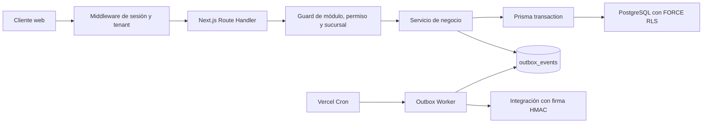
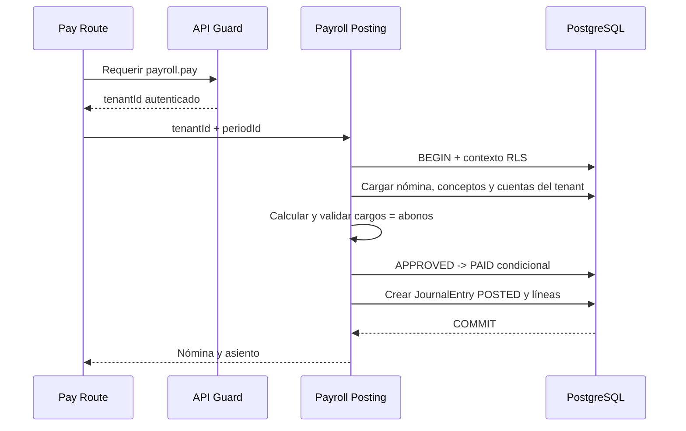

# Gerpy: Arquitectura Técnica

**Estado:** línea base técnica para producción

**Última actualización:** 27 de julio de 2026

**Ámbito:** backend, datos, seguridad, procesamiento financiero y calidad

## Resumen Ejecutivo del Sistema

Gerpy es un ERP financiero y operativo multi-tenant. Centraliza procesos de
administración, recursos humanos, nómina, contabilidad, inventario, ventas e
integraciones sin compartir datos entre organizaciones.

El sistema utiliza PostgreSQL como fuente transaccional de verdad. La
aplicación resuelve la identidad y el contexto operativo desde una sesión
persistida, aplica autorización granular y ejecuta las consultas sensibles
dentro de transacciones con Row-Level Security (RLS).

| Capa | Tecnología | Responsabilidad |
| --- | --- | --- |
| Aplicación | Next.js App Router y TypeScript | Route Handlers, middleware, servicios y renderizado |
| Acceso a datos | Prisma ORM | Modelo relacional, migraciones y transacciones |
| Base transaccional | PostgreSQL | Integridad, claves compuestas, unicidad y RLS |
| Autenticación | Auth.js/NextAuth y JWT con JTI | Inicio de sesión, contexto y revocación |
| Segundo factor | TOTP | Alta, verificación y recuperación de 2FA |
| Procesamiento asíncrono | Outbox Worker y Vercel Cron | Entrega confiable de eventos |
| QA | Node Test Runner y Playwright | Pruebas unitarias, integración y E2E |
| CI | GitHub Actions | Migraciones, typecheck y pruebas automatizadas |

MongoDB/Mongoose puede utilizarse para cargas documentales auxiliares. Los
registros monetarios, permisos, sesiones y membresías permanecen en
PostgreSQL.

## Vista General

La autoridad de seguridad fluye desde la sesión hacia el backend. Los
identificadores enviados por URL, body o headers nunca sustituyen el
`tenantId` autenticado.

## Arquitectura Multi-Tenant y Seguridad

### Modelo de identidad y pertenencia

La identidad global está separada de la pertenencia organizacional:

- `User` representa una identidad única y no contiene un `tenantId`.
- `TenantMembership` vincula un usuario con un tenant y define su estado.
- `BranchMembership` autoriza la pertenencia operativa a una sucursal.
- `RoleAssignment` asigna un rol vigente a una membresía y, cuando
  corresponde, a una sucursal.
- `Role` y `Permission` expresan autorización por
  `módulo.recurso.acción`.

Las relaciones sensibles reutilizan `tenantId` en claves compuestas. Por
ejemplo, una asignación referencia membresía, rol y sucursal mediante el
mismo tenant. Esto impide construir relaciones válidas entre registros de
organizaciones distintas.

### RBAC

`RoleScope` define tres niveles:

| Scope | Alcance |
| --- | --- |
| `SYSTEM` | Administración global del sistema |
| `TENANT` | Operación consolidada dentro de un tenant |
| `BRANCH` | Operación restringida a una sucursal activa |

`lib/auth/tenant-context.ts` obtiene las asignaciones vigentes, descarta las
revocadas o expiradas y aplana sus permisos. Los roles `BRANCH` solo aportan
permisos cuando su `branchId` coincide con la sucursal activa.

`lib/api/module-access.ts` mantiene el mapa explícito entre rutas, métodos y
permisos granulares. `lib/api/context.ts` centraliza las siguientes
validaciones:

1. Sesión autenticada y activa.
2. Tenant derivado de la sesión.
3. Módulo habilitado.
4. Permiso requerido por la operación.
5. Acceso a la sucursal solicitada.

Los roles `SYSTEM` pueden operar sin tenant únicamente en rutas de
administración declaradas para ese alcance.

### Contexto confiable de la petición

El JWT incluye `jti`, usuario, tenant activo, sucursal, sucursales
autorizadas, scopes, módulos y permisos. El middleware valida el JTI contra
la tabla `Session` y propaga internamente el contexto validado.

El header `x-tenant-id` es una comprobación de consistencia, no una fuente de
autoridad. Si el cliente envía un tenant diferente al de la sesión, la
petición se rechaza con `403 Forbidden`.

### Row-Level Security

`prisma/rls.sql` instala la función
`private.current_tenant_id()`, que obtiene el tenant de:

`current_setting('app.current_tenant_id', true)`.

`lib/db/prisma.ts` proporciona `withTenantTransaction()` y
`setTenantTransactionContext()`. Cada transacción tenant-scoped:

1. Activa localmente el rol PostgreSQL `authenticated`.
2. Define `app.current_tenant_id` con `set_config`.
3. Ejecuta las consultas Prisma en la misma transacción.
4. Descarta automáticamente el contexto al finalizar la transacción.

Las tablas con `tenantId` usan `ENABLE ROW LEVEL SECURITY` y
`FORCE ROW LEVEL SECURITY`. Las políticas aplican:

- `USING` para limitar lectura, actualización y eliminación.
- `WITH CHECK` para impedir inserciones o cambios de tenant.
- Acceso a `users` y credenciales globales mediante una membresía del tenant
  activo.
- Acceso a `role_permissions` mediante el tenant propietario del rol.
- Acceso append-only a `AuditLog` y `SecurityEvent` para el rol de
  aplicación; no se conceden `UPDATE` ni `DELETE`.

#### Alcance de sucursal

RLS constituye la frontera obligatoria entre tenants. El aislamiento por
sucursal se completa con tres controles adicionales:

- `BranchMembership` y `RoleAssignment` con vigencia y revocación.
- Relaciones y consultas que combinan `tenantId` y `branchId`.
- Guards que rechazan una sucursal fuera de `branchIds`.

Por diseño actual, PostgreSQL no recibe `app.current_branch_id`. En
consecuencia, RLS evita fugas cross-tenant y el guard de aplicación impone la
frontera intra-tenant por sucursal. Ambas capas son obligatorias.

### Sesiones, auditoría y protecciones perimetrales

Cada login genera un JTI UUID, persiste una fila `Session` y registra
actividad, IP y dispositivo. El JTI deja de ser válido cuando la sesión:

- Está revocada.
- Expiró.
- No coincide con el usuario o tenant del token.
- Fue invalidada por logout o por un cambio de autorización.

`SecurityEvent` registra login exitoso, login fallido, logout, bloqueo,
cambio de contraseña, eventos MFA y revocación. `AuditLog` registra actor,
tenant, sucursal, acción, entidad, valores previos/nuevos, IP y
`correlationId`.

La autenticación de dos pasos almacena el secreto TOTP cifrado en
`MfaCredential`; los códigos de recuperación se almacenan como hashes y
pueden marcarse como usados.

El endpoint de login limita cada IP a cinco intentos por minuto y responde
`429 Too Many Requests` al sexto intento. La implementación actual es en
memoria y por instancia. Un despliegue horizontal debe sustituir este
almacén por Redis/KV para aplicar una cuota global.

### Matriz de amenazas

| Amenaza | Controles |
| --- | --- |
| Suplantación de tenant | Tenant desde sesión, rechazo de header discrepante y RLS |
| Fuga entre sucursales | Membresía, scope `BRANCH`, claves compuestas y guard |
| Escalada de privilegios | Permisos por método/ruta y validación server-side |
| Token robado o revocado | JTI persistido, expiración y `isRevoked` |
| Fuerza bruta | Rate limit por IP y eventos de seguridad |
| Manipulación de auditoría | Tablas append-only para el rol de aplicación |
| Webhook falsificado o repetido | HMAC, ventana temporal e idempotency key |
| Pago duplicado | Transacción, cambio condicional de estado e índice único |

## Procesamiento de Transacciones (El Core Financiero)

### Flujo de Nómina a Contabilidad

El endpoint
`POST /api/payroll/periods/[periodId]/pay` exige el permiso `payroll.pay` y
delega la operación a `lib/accounting/payroll-posting.ts`.

Invariantes financieras:

- La nómina, sus conceptos, el asiento y cada cuenta pertenecen al mismo
  `tenantId`.
- La nómina debe estar `APPROVED` antes de pagarse.
- Debe existir al menos un concepto de nómina.
- La cuenta de gasto debe ser `EXPENSE` y la cuenta de pago `ASSET`.
- Los importes se normalizan a dos decimales.
- La suma de cargos debe ser positiva e idéntica a la suma de abonos.
- El cambio a `PAID` y la creación del asiento se confirman en una sola
  transacción.

La contabilización estándar carga la cuenta de gasto de nómina y abona la
cuenta de pago por el total neto.

### Idempotencia y `409 Conflict`

`JournalEntry` define la restricción única:

`@@unique([tenantId, sourceType, sourceId])`.

Para nómina, `sourceType` es `PAYROLL` y `sourceId` es el identificador del
periodo. El servicio consulta primero esa clave y también captura la
violación única de Prisma `P2002` ante carreras concurrentes.

Si ya existe un asiento, el servicio valida nuevamente tenant, estado,
cuentas y cuadratura, y devuelve el registro existente sin duplicarlo. La
ruta HTTP traduce ese resultado idempotente a `409 Conflict` con el código
`PAYROLL_ALREADY_PROCESSED`.

### Patrón Outbox

Los efectos externos se representan como filas `OutboxEvent` creadas junto
con la operación de negocio. Sus estados son:

`PENDING -> PROCESSING -> PROCESSED`

Un fallo recuperable regresa el evento a `PENDING` con backoff exponencial.
Al alcanzar el máximo de intentos, queda en `FAILED`, que funciona como
dead-letter operativo.

El worker de `lib/integrations/outbox-worker.ts` garantiza:

- Claim atómico por lotes con `FOR UPDATE SKIP LOCKED`.
- Lease temporal para recuperar trabajos abandonados.
- Control optimista por estado y número de intento.
- Backoff exponencial acotado.
- Máximo de intentos antes de `FAILED`.
- Contexto RLS por tenant al actualizar cada evento.

Vercel ejecuta `GET /api/integrations/outbox` cada minuto según
`vercel.json`. La invocación del cron exige `Authorization: Bearer
<CRON_SECRET>`.

### Seguridad de Webhooks

Los webhooks usan HMAC-SHA256 sobre:

`timestamp + "." + body`.

La firma viaja en `x-webhook-signature` y el tiempo en
`x-webhook-timestamp`. La validación usa comparación constante, rechaza
firmas antiguas fuera de una ventana de cinco minutos y limita el body
entrante a 16 KiB.

Las entregas salientes incluyen además `idempotency-key` con el ID del
evento. En producción, el destino debe usar HTTPS y los secretos
`INTEGRATIONS_WEBHOOK_SECRET`, `OUTBOX_WEBHOOK_SECRET` y `CRON_SECRET` deben
gestionarse fuera del repositorio.

## Estrategia de Pruebas (QA)

### Pirámide de pruebas

| Nivel | Cobertura principal | Ejecución |
| --- | --- | --- |
| Unitarias | Contraseñas, rate limit, RBAC, cuadratura y backoff | `npm run test:auth`, `npm run test:api` |
| Integración | RLS real, revocación JTI y persistencia PostgreSQL | prueba de aislamiento y `npm run test:session` |
| E2E | Autenticación, 2FA, RBAC, multi-tenant y nómina | `npm run test:e2e` |
| Estática | Contratos TypeScript y Prisma Client | `npm run typecheck` |

`scripts/tenant-isolation.test.mjs` crea dos tenants, activa diferentes
contextos de transacción y verifica que Tenant, Branch, AuditLog y
JournalEntry solo expongan filas del tenant activo. También intenta una
escritura cross-tenant y espera su rechazo.

`scripts/session-revocation.test.mjs` comprueba que una sesión persistida es
válida antes de revocarse y que el mismo JWT deja de aceptarse después.

### Cobertura E2E con Playwright

`tests/e2e/global-setup.ts` ejecuta el seed reproducible y prepara dos
tenants. Playwright trabaja en Chromium headless, con un worker para evitar
interferencia de estado y conserva trazas, video y capturas ante fallos.

La suite cubre:

- Login válido y navegación a rutas protegidas.
- Sexto intento de login rechazado con HTTP `429`.
- Activación TOTP, persistencia del estado y desafío 2FA posterior.
- Acceso directo de un empleado a administración rechazado.
- Intento de pago sin `payroll.pay` rechazado con `403`.
- Manipulación de URL y `x-tenant-id` sin fuga de nóminas o empleados.
- Estado de carga y botón deshabilitado durante el pago.
- Pago exitoso y transición de nómina.
- Dos pagos concurrentes resueltos como `200` y `409` sin romper la UI.

Estas pruebas validan prevención de escalada de privilegios, aislamiento,
idempotencia y tolerancia a carreras de red.

### Integración continua

`.github/workflows/backend.yml` se ejecuta en cada push y pull request hacia
`main`. El pipeline:

1. Inicia PostgreSQL 16.
2. Instala dependencias y genera Prisma Client.
3. Ejecuta `prisma migrate deploy`.
4. Crea el rol RLS `authenticated`.
5. Ejecuta typecheck y pruebas unitarias/de integración.
6. Carga un seed aislado.
7. Instala Chromium y ejecuta Playwright headless.
8. Publica diagnósticos de Playwright si existe un fallo.

## Despliegue y Operación

El despliegue estándar aplica las migraciones versionadas con
`npx prisma migrate deploy` y después instala las políticas mediante
`prisma/rls.sql`. El procedimiento expand/backfill/contract para bases
legacy está documentado en
`docs/workplan2/release-phase-evidence.md`.

Controles mínimos de producción:

- Usar un rol PostgreSQL sin `BYPASSRLS`.
- Aplicar `prisma/rls.sql` después de las migraciones.
- Configurar `DATABASE_URL`, `DIRECT_URL`, secretos de autenticación, MFA,
  cron y webhooks en el gestor de secretos.
- Mantener TLS para PostgreSQL y HTTPS para webhooks.
- Alertar sobre eventos Outbox en `FAILED`, intentos de login anómalos y
  revocaciones de sesión.
- Ejecutar el pipeline completo antes de promover una versión.

## Mapa de Implementación

| Área | Archivo principal |
| --- | --- |
| Modelo de datos | `prisma/schema.prisma` |
| Políticas RLS | `prisma/rls.sql` |
| Transacciones tenant-scoped | `lib/db/prisma.ts` |
| Contexto RBAC | `lib/auth/tenant-context.ts` |
| Guard central | `lib/api/context.ts` |
| Permisos por ruta | `lib/api/module-access.ts` |
| Sesiones y JTI | `lib/auth/session.ts` |
| Rate limit | `lib/auth/login-rate-limit.ts` |
| Nómina a contabilidad | `lib/accounting/payroll-posting.ts` |
| Worker Outbox | `lib/integrations/outbox-worker.ts` |
| Firma HMAC | `lib/integrations/webhook-signature.ts` |
| Cron | `vercel.json` |
| E2E | `tests/e2e/core-business-flow.spec.ts` |
| CI | `.github/workflows/backend.yml` |
