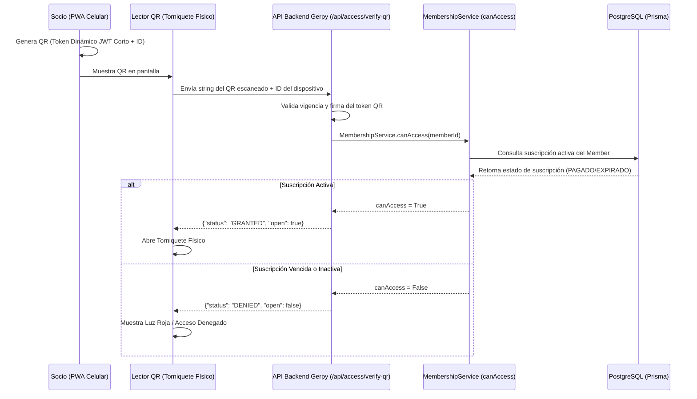

# Guía de Integración Backend y Base de Datos - PWA de Socios (B2C)

Este documento detalla la hoja de ruta técnica, cambios de base de datos y diseño de APIs necesarios para migrar el prototipo actual de la PWA de socios a una integración de producción real con el backend transaccional de **Gerpy**.

---

## 1. Cambios Requeridos en la Base de Datos (PostgreSQL + Prisma)

Para conectar las interfaces simuladas (rutinas, check-in, horarios) con datos reales, se deben agregar los siguientes modelos a `prisma/schema.prisma` y ejecutar `prisma migrate dev`.

### A. Vinculación de Cuenta de Usuario con la Ficha de Socio
En el modelo `User`, añade la relación uno a uno opcional con `Member` (análogo a `employeeId`):

```prisma
model User {
  id           String     @id @default(cuid())
  // ... campos existentes
  memberId     String?    @unique
  member       Member?    @relation(fields: [memberId], references: [id], onDelete: Cascade)
  // ... resto del modelo
}
```

### B. Nuevos Modelos para Rutinas de Entrenamiento
Para guardar las rutinas y ejercicios asignados a cada socio:

```prisma
model WorkoutPlan {
  id          String   @id @default(cuid())
  tenantId    String
  tenant      Tenant   @relation(fields: [tenantId], references: [id], onDelete: Cascade)
  memberId    String
  member      Member   @relation(fields: [memberId], references: [id], onDelete: Cascade)
  name        String   // Ej: "Pecho y Tríceps (Fuerza)"
  description String?
  createdAt   DateTime @default(now())
  updatedAt   DateTime @updatedAt
  exercises   WorkoutPlanExercise[]

  @@index([tenantId, memberId])
  @@map("workout_plans")
}

model WorkoutPlanExercise {
  id            String      @id @default(cuid())
  workoutPlanId String
  workoutPlan   WorkoutPlan @relation(fields: [workoutPlanId], references: [id], onDelete: Cascade)
  exerciseName  String      // Ej: "Press de Banca"
  series        Int
  reps          String      // Ej: "12-10-8" o "Al Fallo"
  weight        String?     // Ej: "60 kg"
  restSeconds   Int?
  notes         String?

  @@map("workout_plan_exercises")
}
```

### C. Nuevos Modelos para Horarios y Reservas de Clases
Para administrar las clases grupales y los cupos de los socios:

```prisma
model ClassSession {
  id          String   @id @default(cuid())
  tenantId    String
  tenant      Tenant   @relation(fields: [tenantId], references: [id], onDelete: Cascade)
  branchId    String
  branch      Branch   @relation(fields: [branchId], references: [id])
  name        String   // Ej: "Crossfit WOD"
  trainer     String   // Opcionalmente relación con Employee/Specialist
  startTime   DateTime
  endTime     DateTime
  capacity    Int
  createdAt   DateTime @default(now())
  updatedAt   DateTime @updatedAt
  bookings    ClassBooking[]

  @@index([tenantId, branchId, startTime])
  @@map("class_sessions")
}

model ClassBooking {
  id             String       @id @default(cuid())
  classSessionId String
  classSession   ClassSession @relation(fields: [classSessionId], references: [id], onDelete: Cascade)
  memberId       String
  member         Member       @relation(fields: [memberId], references: [id], onDelete: Cascade)
  status         String       // "PENDING", "CONFIRMED", "ATTENDED", "CANCELLED"
  createdAt      DateTime     @default(now())

  @@unique([classSessionId, memberId])
  @@map("class_bookings")
}
```

---

## 2. Cambios Requeridos en la Base de Datos Documental (MongoDB)

Para las características sociales, logs de progreso físico y gamificación, se implementarán esquemas Mongoose dinámicos para evitar saturar PostgreSQL:

* **Progreso Físico (`member_progress`):**
  Guarda el histórico de mediciones de composición corporal del socio (peso, músculo, grasa) para alimentar la gráfica de evolución de la PWA.
* **Historial de Gamificación (`member_points_ledger`):**
  Registra la bitácora de adquisición de XP (puntos de experiencia) acumulados por check-in diario, retos completados o reservaciones.
* **Grupos del Gimnasio (`member_groups`):**
  Almacena la estructura de foros o grupos sociales internos creados por los socios para interactuar.

---

## 3. Arquitectura y Seguridad de la API (B2C)

De acuerdo con el mandamiento de **Autoservicio B2C**, las acciones de los socios deben atacar APIs específicas dedicadas que garanticen el aislamiento estricto de datos.

### A. Namespace Dedicado de APIs
Todas las rutas de la PWA deben apuntar a: `/api/client/...`
* `/api/client/workouts` (GET: Ver rutinas del miembro autenticado).
* `/api/client/schedule` (GET: Ver clases disponibles en su sucursal).
* `/api/client/bookings` (POST: Reservar clase, DELETE: Cancelar reserva).
* `/api/client/progress` (GET/POST: Historial de peso y marcas personales).
* `/api/client/profile` (GET: Obtener detalles de perfil, datos personales y detalles de suscripción del socio).
* `/api/client/settings` (GET/PATCH: Consultar y actualizar preferencias de notificaciones, recordatorios y personalización).

### B. Control de Acceso y Aislamiento Multi-Tenant
1. **Validación de Token:** El middleware leerá la sesión JWT y garantizará que el rol contenga `MEMBER`.
2. **Filtro Forzado de Tenant y Usuario:**
   El backend **nunca** debe confiar en parámetros id/tenant enviados en el cuerpo (body) de la petición para filtrar datos personales. El `memberId` y `tenantId` deben extraerse estrictamente del JWT verificado en el servidor:
   ```typescript
   // Ejemplo en endpoint GET /api/client/workouts
   const context = await requireApiContext(); // Obtiene tenantId y userId del JWT
   
   const workouts = await prisma.workoutPlan.findMany({
     where: {
       tenantId: context.tenantId, // Aislamiento Multi-tenant
       memberId: context.user.memberId // Aislamiento de Privacidad
     },
     include: { exercises: true }
   });
   ```

---

## 4. Flujo de Check-In por Código QR (Membresías es "Rey del Acceso")

El flujo transaccional y de hardware para el control de acceso en torniquete funciona de la siguiente manera:



### Componente del Token QR Dinámico:
El código QR se genera en la PWA utilizando un JWT firmado por el backend con expiración de 15 segundos:
```typescript
// Estructura del payload del token QR dinámico
{
  "memberId": "cuid_del_socio",
  "tenantId": "cuid_del_gimnasio",
  "exp": 1718002930 // Unix timestamp + 15 segundos
}
```

---

## 5. Estrategia de Despliegue de Marca Blanca (Multi-Domain)

Para implementar el acceso por subdominio o slugs en producción:
1. **Configuración de Vercel Wildcard Domains:**
   Habilitar subdominios comodín `*.gerpy.com` en tu hosting.
2. **Middleware Host Resolution:**
   El `middleware.ts` puede leer el host de la cabecera HTTP (`request.headers.get("host")`) para detectar si el usuario entra por un subdominio específico (ej. `fitmax.gerpy.com`) y reescribir internamente la ruta hacia la carpeta `/portal/fitmax` de manera transparente para el usuario.
