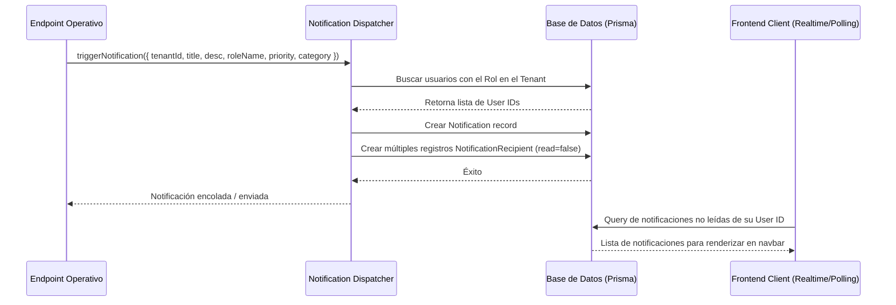

# Arquitectura de Notificaciones y Despacho RBAC

Este documento contiene las especificaciones para la implementación del backend, persistencia e integración del sistema de notificaciones con Control de Acceso Basado en Roles (RBAC) en Gerpy ERP.

---

## 1. Modelo de Base de Datos Propuesto (Prisma Schema)

Para soportar notificaciones multi-tenant que puedan dirigirse a:
1. Un usuario específico (`userId`).
2. Todos los usuarios con un rol determinado en un tenant/sucursal (`targetRole`).
3. Todos los usuarios de una sucursal (`branchId`).
4. Todos los usuarios de un tenant (`tenantId`).

Se propone añadir los siguientes modelos al archivo `prisma/schema.prisma`:

```prisma
enum NotificationPriority {
  INFO
  WARNING
  CRITICAL
}

enum NotificationCategory {
  FINANCE
  ACCESS
  MEMBERSHIPS
  SYSTEM
  HR
  ADMIN
}

model Notification {
  id          String               @id @default(cuid())
  tenantId    String               // Multi-tenant isolation
  tenant      Tenant               @relation(fields: [tenantId], references: [id], onDelete: Cascade)
  branchId    String?              // Optional: Restrict visibility to a specific branch
  branch      Branch?              @relation(fields: [branchId], references: [id])
  
  title       String
  description String
  category    NotificationCategory @default(INFO)
  priority    NotificationPriority @default(INFO)
  
  // RBAC Routing Target
  targetRoleId String?             // Target specific Role ID (optional)
  targetRole   Role?               @relation(fields: [targetRoleId], references: [id])
  
  // Link to entity that triggered it (optional, for redirection/details)
  resourceType String?             // e.g., "Invoice", "Member", "AccessDevice"
  resourceId   String?             // e.g., CUID of the record
  
  createdAt    DateTime            @default(now())
  
  // Recipient tracking list for read/unread state per user
  recipients   NotificationRecipient[]

  @@index([tenantId])
  @@index([tenantId, createdAt])
  @@index([targetRoleId])
  @@map("notifications")
}

model NotificationRecipient {
  id             String       @id @default(cuid())
  notificationId String
  notification   Notification @relation(fields: [notificationId], references: [id], onDelete: Cascade)
  
  userId         String       // Recipient User ID
  user           User         @relation(fields: [userId], references: [id], onDelete: Cascade)
  
  read           Boolean      @default(false)
  readAt         DateTime?
  deleted        Boolean      @default(false) // Soft delete per user

  @@unique([notificationId, userId])
  @@index([userId, read])
  @@map("notification_recipients")
}
```

---

## 2. Flujo de Despacho e Integración RBAC



### Reglas de Visibilidad e Inserción

1. **Notificación Directa a Usuario:**
   - Si una acción va dirigida a una persona específica (ej: "Tu solicitud de vacaciones fue aprobada"), se inserta directamente en `NotificationRecipient` para ese `userId`.

2. **Notificación Dirigida por Roles (RBAC):**
   - Cuando ocurre un evento como *"Pago rechazado"* o *"Membresía vencida en torniquete"*, el Dispatcher consulta la tabla `UserRole` para determinar los usuarios que tienen dicho rol (`roleId` o `roleName`) en ese tenant y sucursal, y crea un `NotificationRecipient` para cada uno de ellos.
   - De esta manera, cada usuario tiene su propio estado de lectura (`read` / `readAt`), evitando que cuando el "Administrador A" marque la notificación como leída, le aparezca leída también al "Administrador B".

---

## 3. Ejemplo de Implementación en Backend (Next.js API Route)

A continuación se muestra un ejemplo de un servicio helper en Node.js/Next.js para disparar notificaciones basadas en roles:

```typescript
// file: lib/services/notification-service.ts
import { prisma } from "@/lib/db/prisma";
import { NotificationCategory, NotificationPriority } from "@prisma/client";

interface TriggerNotificationInput {
  tenantId: string;
  branchId?: string;
  title: string;
  description: string;
  category: NotificationCategory;
  priority: NotificationPriority;
  targetRoleName?: string; // Nombre del rol destino (ej. "Receptionist", "Finance Manager")
  targetUserId?: string;   // Destinatario individual
}

export async function triggerNotification(input: TriggerNotificationInput) {
  const {
    tenantId,
    branchId,
    title,
    description,
    category,
    priority,
    targetRoleName,
    targetUserId
  } = input;

  // 1. Obtener los User IDs destinatarios
  const recipientUserIds = new Set<string>();

  // Si va dirigida a un usuario específico
  if (targetUserId) {
    recipientUserIds.add(targetUserId);
  }

  // Si va dirigida a un rol específico
  if (targetRoleName) {
    // Buscar rol en el tenant
    const role = await prisma.role.findFirst({
      where: {
        tenantId,
        name: targetRoleName
      },
      include: {
        users: {
          select: {
            userId: true,
            branchId: true
          }
        }
      }
    });

    if (role) {
      role.users.forEach((userRole) => {
        // Si especificamos sucursal, opcionalmente filtramos destinatarios por sucursal
        if (!branchId || !userRole.branchId || userRole.branchId === branchId) {
          recipientUserIds.add(userRole.userId);
        }
      });
    }
  }

  if (recipientUserIds.size === 0 && !targetRoleName && !targetUserId) {
    // Si no hay target definido, opcionalmente enviar a todos los administradores del tenant
    const admins = await prisma.userRole.findMany({
      where: {
        role: {
          name: "Admin",
          tenantId
        }
      },
      select: { userId: true }
    });
    admins.forEach(a => recipientUserIds.add(a.userId));
  }

  // 2. Crear la notificación y asignar los recipientes en una transacción
  return await prisma.$transaction(async (tx) => {
    // Crear el registro de notificación principal
    const notification = await tx.notification.create({
      data: {
        tenantId,
        branchId,
        title,
        description,
        category,
        priority,
      }
    });

    // Crear la relación para cada destinatario
    if (recipientUserIds.size > 0) {
      const recipientData = Array.from(recipientUserIds).map((userId) => ({
        notificationId: notification.id,
        userId,
        read: false
      }));

      await tx.notificationRecipient.createMany({
        data: recipientData
      });
    }

    return notification;
  });
}
```

---

## 4. Ejemplos de Timbrado de Notificaciones en Diferentes Endpoints

### Ejemplo A: Pago de Suscripción Rechazado (Módulo de Finanzas / Stripe Webhook)
```typescript
// app/api/webhooks/stripe/route.ts
import { NextResponse } from "next/server";
import { triggerNotification } from "@/lib/services/notification-service";

export async function POST(req: Request) {
  const event = await req.json();

  if (event.type === "invoice.payment_failed") {
    const session = event.data.object;
    const tenantId = session.metadata.tenantId;
    const customerName = session.customer_email;

    await triggerNotification({
      tenantId,
      title: "Pago de membresía fallido",
      description: `El cobro automático de la membresía para ${customerName} por $850.00 MXN falló.`,
      category: "FINANCE",
      priority: "CRITICAL",
      targetRoleName: "Finance Manager" // Dirigido al equipo de Finanzas
    });
  }

  return NextResponse.json({ received: true });
}
```

### Ejemplo B: Alerta de Acceso Denegado (Módulo de Control de Acceso)
```typescript
// app/api/access/verify/route.ts
import { NextResponse } from "next/server";
import { triggerNotification } from "@/lib/services/notification-service";

export async function POST(req: Request) {
  const { deviceId, cardId, tenantId, branchId } = await req.json();

  // Lógica de validación de membresía del socio...
  const accessGranted = false; 
  const reason = "Membresía Vencida";

  if (!accessGranted) {
    await triggerNotification({
      tenantId,
      branchId,
      title: "Acceso Denegado en Torniquete",
      description: `Socio con Tarjeta ID ${cardId} intentó ingresar. Razón: ${reason}.`,
      category: "ACCESS",
      priority: "WARNING",
      targetRoleName: "Receptionist" // Dirigido a Recepcionistas para atención inmediata
    });
  }

  return NextResponse.json({ allowed: false });
}
```
