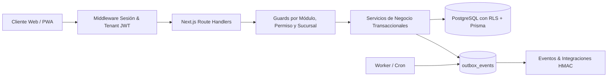

<<<<<<< HEAD
# The-Tower-Power-ERP

The-Tower-Power-ERP, anteriormente Gerpy, es un ERP financiero y operativo
multi-tenant construido con Next.js App Router, TypeScript, Prisma ORM,
Supabase PostgreSQL y MongoDB. Su arquitectura combina sesiones revocables
mediante JTI, RBAC por tenant y sucursal, Row-Level Security, gamificación
aislada, contabilización idempotente y procesamiento asíncrono mediante
Outbox.
=======
# Gerpy — ERP Financiero y Operativo Multi-Tenant

**Gerpy** (The Tower Power) es una plataforma ERP SaaS de grado empresarial construida para la gestión operativa y financiera multi-sucursal de centros deportivos y gimnasios. 
>>>>>>> a8d59c92aebe313924b1399de1671b90df68d3a4

Desarrollada sobre **Next.js 15 App Router**, **TypeScript**, **Prisma ORM sobre PostgreSQL** (con **Row-Level Security**) y **MongoDB/Mongoose** para almacenamiento documental/eventos.

---

<<<<<<< HEAD
- Modelo multi-tenant y RBAC.
- Aislamiento PostgreSQL RLS y guards de sucursal.
- Sesiones, 2FA, rate limiting y auditoría.
- Estrategia dual PostgreSQL/MongoDB.
- Mandamientos y checklist de integración frontend.
- Flujo transaccional de nómina a contabilidad.
- Idempotencia, Outbox, cron y webhooks HMAC.
- Estrategia de pruebas y pipeline de CI.
=======
##  Características Principales
>>>>>>> a8d59c92aebe313924b1399de1671b90df68d3a4

### Multi-Tenancy y Seguridad Avanzada
- **Aislamiento Estricto por Tenant**: Derivación segura de contexto desde la sesión Auth.js/JWT; no se permite suplantación por headers.
- **Row-Level Security (RLS)**: Enforzamiento a nivel base de datos en PostgreSQL mediante `prisma/rls.sql` y `current_tenant_id()`.
- **Control de Acceso Basado en Roles (RBAC)**: Scopes `SYSTEM`, `TENANT` y `BRANCH` con permisos granulares (`módulo.recurso.acción`).
- **Autenticación y 2FA/TOTP**: Credenciales, OAuth (Google y Discord), segundo factor de autenticación TOTP y revocación de sesiones por JTI.
- **Auditoría Append-Only**: Tablas `AuditLog` y `SecurityEvent` protegidas contra modificaciones o eliminaciones.

### Módulos ERP Operativos (18 Módulos)
1. **Dashboard Executivo**: KPIs consolidados de ingresos, miembros activos, asistencia e inventario.
2. **Membresías**: Gestión de miembros, planes y ciclo de vida de suscripciones (activo, pausado, cancelado).
3. **Control de Acceso**: Endpoint `/api/access/validate` en milisegundos para hardware/torniquetes QR y telemetría en MongoDB.
4. **Punto de Venta (POS)**: Checkout transaccional con decremento atómico de inventario, emisión de pagos y eventos outbox.
5. **Inventarios y Almacenes**: Control de stock por sucursal, kardex y movimientos de inventario (`SALE`, `PURCHASE`, `ADJUSTMENT`).
6. **Catálogo y Compras**: Maestro de productos/categorías y facturas de proveedores.
7. **Recursos Humanos & Asistencia**: Checador digital de entradas/salidas con prevención de doble marcaje.
8. **Especialistas & Comisiones**: Motor de liquidación para entrenadores (renta fija, comisión 85/15 o esquemas híbridos).
9. **Nómina y Contabilidad**: Asientos contables automáticos y balanceados (Débito = Crédito) generados al pagar períodos de nómina.
10. **Finanzas & Conciliación**: Facturación, cuentas por cobrar/pagar y pareo de pagos.
11. **CRM & Churn Risk**: Algoritmo de predicción de riesgo de cancelación y automatización de recordatorios de renovación.
12. **Analytics & BI**: Métricas de retención, churn y snapshots analíticos.
13. **Super-Admin SaaS Control Center**: Gestión de organizaciones/tenants, suspensión de licencias y feature gating por plan (*Basic*, *Pro*, *Enterprise*).
14. **White-Label / Branding Dinámico**: Personalización de logotipos, colores e identidad de marca por tenant.
15. **Integraciones & Outbox Worker**: Procesamiento asíncrono e idempotente de eventos de webhook y auditoría.
16. **Mantenimiento**: Gestión de tickets de servicio para equipos e instalaciones.

---

## Arquitectura Técnica



---

## Estructura del Repositorio

```text
Gerpy/
├── app/                    # Next.js App Router (páginas localizadas, layouts, APIs)
│   ├── [locale]/           # Rutas i18n (es, en, fr)
│   └── api/                # Route Handlers API (auth, pos, hr, memberships, etc.)
├── components/             # Componentes UI (Shadcn/Radix, Tailwind, módulos UI)
│   ├── branding/           # Motor de White-Label & Style Provider
│   └── modules/            # Interfaces de usuario por módulo ERP
├── docs/                   # Documentación técnica y especificaciones de producción
│   ├── audit/              # Guías de testing, QA y arquitectura
│   │   ├── agent-guidelines.md
│   │   └── testing-guidelines.md
│   ├── ARCHITECTURE.md     # Especificación técnica oficial de arquitectura
│   ├── INTEGRATION_PWA.md  # Guía de integración Progressive Web App
│   ├── NOTIFICATIONS_RBAC.md # Especificación de notificaciones y permisos
│   └── ONBOARDING_BACKEND_INTEGRATION.md # Flujo de onboarding y bootstrap de tenant
├── lib/                    # Lógica de dominio, cliente Prisma, Mongo, RBAC, servicios
├── modules/                # Capa de servicio por dominio (auth, pos, especialistas)
├── prisma/                 # Esquema Prisma PostgreSQL y scripts de RLS
├── scripts/                # Suites de prueba, seeds de desarrollo y utilidades QA
└── tests/                  # Pruebas End-to-End con Playwright
```

---

## Comandos de Desarrollo y Validación

### Instalación y Configuración Inicial
```bash
# Instalar dependencias
pnpm install

# Generar cliente de Prisma
pnpm db:generate

# Iniciar servidor de desarrollo
pnpm dev
```

### Pruebas y Calidad de Código
```bash
# Validación de tipos TypeScript
pnpm typecheck

# Pruebas de Autenticación y RBAC
pnpm test:auth

# Pruebas de APIs y Servicios de Negocio
pnpm test:api

# Pruebas de Aislamiento Multi-Tenant
pnpm test:tenant-isolation

# Pruebas End-to-End con Playwright
pnpm test:e2e

# Pruebas de Accesibilidad (Pa11y)
pnpm check:accessibility:all

# Verificación de Lighthouse CI
pnpm lhci:all

# Compilación de producción
pnpm build
```

---

## Documentación Técnica Adicional

Toda la documentación técnica detallada se encuentra organizada en el directorio [`/docs`](docs/):

- [Especificación Técnica de Arquitectura](docs/ARCHITECTURE.md)
- [Integración PWA y Experiencia Mobile](docs/INTEGRATION_PWA.md)
- [Sistema de Notificaciones y Control RBAC](docs/NOTIFICATIONS_RBAC.md)
- [Flujo de Onboarding e Integración Backend](docs/ONBOARDING_BACKEND_INTEGRATION.md)
- [Guía de Pruebas y Comandos QA](docs/audit/testing-guidelines.md)
- [Reglas y Guías de Arquitectura](docs/audit/agent-guidelines.md)
