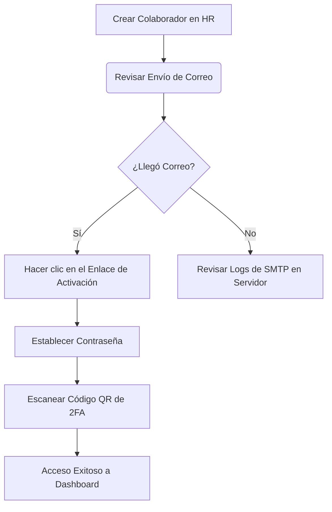

# Guía de Integración y Puesta en Producción

Este documento detalla los pasos técnicos y configuraciones pendientes para conectar por completo el flujo de invitaciones de miembros en producción y asegurar que sea 100% funcional y seguro.

---

## 1. Configuración de Variables de Entorno (SMTP)

Para habilitar el envío de correos electrónicos reales por internet, debes definir las credenciales del servidor de correos (SMTP) en el panel de control de tu hosting o en tu archivo `.env` de producción.

```bash
# Servidor SMTP (ej: smtp.resend.com, smtp.gmail.com, etc.)
SMTP_HOST="smtp.tu-proveedor.com"
SMTP_PORT=587
SMTP_USER="tu-usuario@dominio.com"
SMTP_PASSWORD="tu-contraseña-o-api-key"
SMTP_FROM="Gym Tower Power <no-reply@tu-gimnasio.com>"
SMTP_SECURE="false" # "true" si usas el puerto 465 (SSL)
```

> [!TIP]
> Si deseas utilizar **Gmail**, te recomendamos generar una **Contraseña de Aplicación** específica desde la configuración de seguridad de tu cuenta Google para evitar bloqueos por autenticación básica.

---

## 2. Consistencia de la Firma de Tokens (`AUTH_SECRET`)

El token que se envía en el enlace de invitación se genera statelessly mediante una firma criptográfica HMAC-SHA256 para evitar escrituras redundantes en la base de datos.
La firma utiliza la variable `AUTH_SECRET`. 

* **Requisito**: Debes asegurar que la variable `AUTH_SECRET` tenga un valor persistente, seguro y único en producción (por ejemplo, generado con `openssl rand -base64 32`). Si esta clave cambia o es aleatoria en cada reinicio del servidor, todos los enlaces de invitación previamente enviados quedarán invalidados inmediatamente.

---

## 3. Sincronización de Base de Datos (Prisma)

El flujo de aceptación de invitaciones modifica el estado del `User` y crea registros en la relación `UserRole`. 

* **Acción**: En tu servidor o pipeline de despliegue (CI/CD), ejecuta el comando para aplicar cualquier cambio de esquema y asegurar la sincronización de las tablas de base de datos antes del arranque:
  ```bash
  npx prisma db push
  # O si usas migraciones controladas:
  npx prisma migrate deploy
  ```

---

## 4. Encabezados de Red y Protocolos (Proxies y Dominios)

El backend construye dinámicamente el enlace de invitación basándose en los encabezados HTTP de la petición entrante:

```typescript
const protocol = request.headers.get("x-forwarded-proto") || "http";
const host = request.headers.get("host") || "localhost:3000";
const inviteUrl = `${protocol}://${host}/es/invite/accept?token=${token}`;
```

* **Despliegues en Vercel/Netlify**: Estos proveedores manejan automáticamente los encabezados `x-forwarded-proto` y `host`.
* **Despliegues en Servidores Propios (VPS, Nginx, Docker)**: Asegúrate de configurar Nginx para reenviar los encabezados correctos agregando estas directivas en el bloque de localización (`location /`):
  ```nginx
  proxy_set_header Host $host;
  proxy_set_header X-Real-IP $remote_addr;
  proxy_set_header X-Forwarded-For $proxy_add_x_forwarded_for;
  proxy_set_header X-Forwarded-Proto $scheme;
  ```

---

## 5. Middleware y Rutas Públicas

Hemos añadido soporte en el `middleware.ts` para permitir el acceso público a las rutas del formulario y la aceptación.

* **Rutas Whitelisteadas**:
  - `/invite/accept` (Página visual del formulario)
  - `/api/auth/invite/accept` (Endpoint para procesar la contraseña y activación)
  
> [!IMPORTANT]
> Si agregas nuevas variaciones de idioma a la plataforma (como `/en/invite/accept` o `/fr/invite/accept`), el middleware los procesará correctamente debido a la estructura comodín del locale, pero asegúrate de no bloquear accidentalmente peticiones estáticas bajo estas rutas.

---

## 6. Proceso de Prueba de Integración Recomendado

Antes de abrir la plataforma a producción, ejecuta esta prueba rápida en tu entorno de pruebas (*staging*):



1. Registra un correo de pruebas al que tengas acceso real.
2. Comprueba que el correo electrónico llegue a la bandeja de entrada (o SPAM, según la reputación del dominio remitente).
3. Asegúrate de que el flujo de 2FA se complete y que el usuario quede en estado `ACTIVE` en la base de datos.
