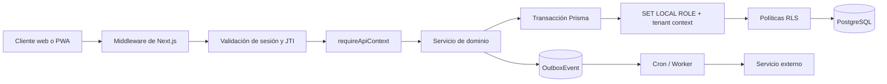
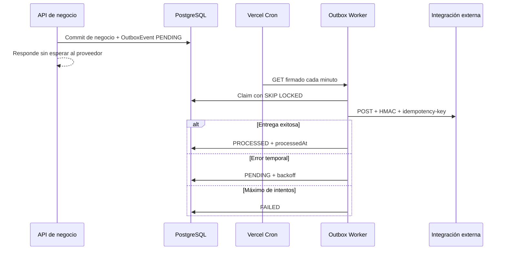
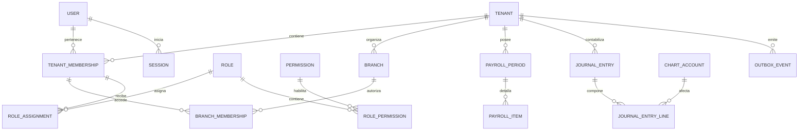

# The Tower Power ERP

## Lógica de Negocio y Arquitectura Backend

**Versión del documento:** 1.0  
**Fecha de referencia:** 2 de agosto de 2026  
**Audiencia:** equipo de desarrollo, responsables de QA y evaluadores técnicos

---

## 1. Propósito y alcance

Este documento describe la arquitectura backend y las reglas de negocio implementadas en **The Tower Power ERP**, una plataforma administrativa multi-tenant construida sobre Next.js 15, Prisma ORM y PostgreSQL.

Su objetivo es que el equipo pueda comprender:

- Cómo se identifica y aísla cada empresa o `Tenant`.
- Cómo se autentica y autoriza cada petición.
- Cómo se modelan roles, permisos, sucursales y membresías.
- Cómo se ejecutan operaciones financieras de manera transaccional e idempotente.
- Cómo se procesan tareas asíncronas mediante el patrón Outbox.
- Qué entidades forman el núcleo de la base de datos.

El documento se basa en el comportamiento actual de `middleware.ts`, `lib/api/context.ts`, `lib/auth`, `lib/db/prisma.ts`, `lib/integrations`, los controladores de `app/api` y `prisma/schema.prisma`.

---

## 2. Visión general del sistema

### 2.1 ¿Qué es The Tower Power ERP?

The Tower Power ERP centraliza operaciones administrativas de múltiples empresas y sucursales. Entre sus dominios principales se encuentran:

- Membresías y portal de miembros.
- Control de acceso físico.
- Recursos humanos, asistencia y nómina.
- Contabilidad, facturación, pagos y finanzas.
- Inventario, almacenes, compras y punto de venta.
- Especialistas, comisiones y liquidaciones.
- Notificaciones, auditoría e integraciones externas.

Cada cliente opera como un `Tenant`. Un tenant puede tener varias sucursales, usuarios, módulos habilitados y reglas de acceso propias.

### 2.2 Stack técnico

| Capa | Tecnología | Responsabilidad |
|---|---|---|
| Aplicación | Next.js 15 con App Router | Rutas HTTP, middleware, Server Components y servicios backend |
| Lenguaje | TypeScript | Tipado estático y contratos entre capas |
| Acceso a datos | Prisma ORM | Consultas, relaciones, transacciones y migraciones |
| Base de datos | PostgreSQL | Persistencia relacional, restricciones, índices y RLS |
| Validación | Zod | Validación de cuerpos, parámetros y configuración |
| Autenticación | NextAuth y sesión propia firmada | Identidad, cookies, JWT, JTI, revocación y 2FA |
| Tareas asíncronas | Outbox + Vercel Cron | Entrega confiable de eventos e integraciones |
| QA | Node Test Runner y Playwright | Pruebas unitarias, integración y E2E |

### 2.3 Topología de una petición



### 2.4 Principio de multi-tenancy

La identidad de una persona es global, pero su acceso empresarial no lo es:

- `User` representa la identidad global.
- `TenantMembership` vincula al usuario con un tenant.
- `BranchMembership` define a qué sucursales puede entrar dentro del tenant.
- `RoleAssignment` determina qué rol posee, en qué ámbito y durante qué vigencia.

Por diseño, `tenantId` **no se acepta como autoridad desde el navegador**. El tenant activo se deriva de la sesión autenticada y se vuelve a validar contra las membresías vigentes.

---

## 3. Aislamiento de datos multi-tenant

El aislamiento se implementa con varias capas. Ninguna capa sustituye a las demás.

### 3.1 Capa 1: contexto de sesión

La sesión contiene, entre otros datos:

```text
userId
tenantId
branchId
branchIds[]
roles[]
roleScopes[]
permissions[]
modules[]
jti
```

Estos datos son emitidos por el backend después de consultar la base de datos. El cliente no debe construirlos ni modificarlos manualmente.

### 3.2 Capa 2: validación perimetral

`middleware.ts` actúa como primer muro de seguridad:

- Omite recursos estáticos y rutas públicas explícitas.
- Exige autenticación para páginas y APIs protegidas.
- valida la firma, expiración y JTI de la sesión.
- Rechaza un `x-tenant-id` que no coincida con la sesión.
- Propaga encabezados internos derivados de la sesión.
- Permite operar sin tenant únicamente a roles `SYSTEM` en rutas administrativas.
- Devuelve `401` cuando no existe una sesión válida y `403` cuando existe sesión, pero el contexto no está autorizado.

El encabezado `x-tenant-id` del cliente funciona como una declaración opcional para detectar inconsistencias, no como fuente de autoridad.

### 3.3 Capa 3: guard centralizado

Los Route Handlers usan `requireApiContext()` o `requireAdminContext()` antes de acceder a datos.

El guard centralizado:

1. Obtiene la sesión propia o la sesión de NextAuth.
2. Vuelve a consultar `TenantMembership`, `BranchMembership` y `RoleAssignment`.
3. Descarta usuarios, tenants, sucursales o asignaciones inactivas, vencidas o revocadas.
4. Verifica que el módulo esté habilitado en `TenantModule`.
5. Resuelve el permiso granular requerido para el método y la ruta.
6. Valida el acceso a la sucursal cuando la operación recibe `branchId`.

Ejemplo de protección de una operación:

```ts
const context = await requireApiContext({
  moduleId: "payroll",
  permission: "payroll.pay",
});
```

### 3.4 Capa 4: filtros y relaciones compuestas

Las consultas de dominio incluyen el tenant autenticado:

```ts
where: {
  id: resourceId,
  tenantId: context.tenantId,
}
```

Además, las relaciones sensibles usan claves compuestas como `[tenantId, id]`. Esto evita asociar accidentalmente una sucursal, membresía, rol o registro financiero de otro tenant.

### 3.5 Capa 5: Row-Level Security de PostgreSQL

PostgreSQL aplica una última frontera mediante Row-Level Security (RLS).

La función `private.current_tenant_id()` lee el tenant activo desde:

```sql
current_setting('app.current_tenant_id', true)
```

`withTenantTransaction()` y `setTenantTransactionContext()` preparan la transacción:

```sql
SET LOCAL ROLE authenticated;
SELECT set_config('app.current_tenant_id', '<tenant-id>', true);
```

Las políticas comparan el `tenantId` de cada fila con el contexto activo:

```sql
USING ("tenantId" = private.current_tenant_id())
WITH CHECK ("tenantId" = private.current_tenant_id())
```

Esto protege tanto lecturas como escrituras:

- `USING` controla qué filas pueden consultarse, actualizarse o eliminarse.
- `WITH CHECK` impide insertar o mover una fila hacia otro tenant.
- `FORCE ROW LEVEL SECURITY` evita que el propietario de la tabla ignore las políticas durante la ejecución autenticada.
- `AuditLog` y `SecurityEvent` son append-only para el rol de aplicación: permiten `SELECT` e `INSERT`, pero no `UPDATE` ni `DELETE`.

> **Invariante:** toda operación que dependa de RLS debe ejecutar sus consultas dentro de la misma transacción que establece `app.current_tenant_id`. Establecer el contexto en una conexión y consultar desde otra no es seguro debido al pool de conexiones.

### 3.6 Tenant y sucursal son fronteras diferentes

RLS aplica el aislamiento principal por `tenantId`. La restricción por sucursal se controla adicionalmente mediante:

- `BranchMembership` vigente.
- `branchIds` resueltos desde la base de datos.
- `requireBranchAccess()`.
- Filtros explícitos por `branchId` en los servicios.
- Relaciones compuestas `[tenantId, branchId]` donde el modelo lo permite.

Por lo tanto, una consulta de sucursal debe validar **tenant y sucursal**, no solo uno de los dos.

---

## 4. Seguridad y control de acceso

### 4.1 Autenticación y ciclo de sesión

El sistema soporta NextAuth y una sesión propia firmada con HMAC-SHA256. En ambos casos, la sesión persistida incorpora un `jti` único.

Flujo de inicio de sesión:

1. Se valida el cuerpo con Zod.
2. Se normaliza el correo y se verifica la contraseña con hash.
3. Si MFA está habilitado, se emite un desafío temporal de 2FA.
4. Se resuelve el contexto real del tenant y sus permisos.
5. Se genera un `jti` criptográficamente único.
6. Se almacena un registro `Session` con expiración, IP, dispositivo y actividad.
7. Se registra `LOGIN_SUCCEEDED` en `SecurityEvent` y `AuditLog`.
8. Se envía una cookie `HttpOnly`, `SameSite=Lax` y `Secure` en producción.

En cada validación se comprueba:

- Que la firma y la expiración del token sean válidas.
- Que el JTI exista y no esté revocado.
- Que el usuario esté activo.
- Que la membresía y el tenant sigan activos.
- Que `userId` y `tenantId` coincidan con la sesión persistida.

El cierre de sesión o un cambio de permisos revoca el JTI. Una cookie antigua deja de ser útil aunque todavía no haya alcanzado su fecha de expiración.

### 4.2 Modelo RBAC

El control de acceso no depende de un campo simple como `user.role`. Se resuelve a través de entidades normalizadas:

| Entidad | Función |
|---|---|
| `Role` | Agrupa una responsabilidad y define su alcance |
| `Permission` | Acción granular con estructura módulo, recurso y acción |
| `RolePermission` | Relación muchos-a-muchos entre roles y permisos |
| `RoleAssignment` | Asigna un rol vigente a una membresía y, opcionalmente, a una sucursal |
| `TenantMembership` | Comprueba que el usuario pertenece al tenant |
| `BranchMembership` | Comprueba que el usuario puede operar en una sucursal |

Los permisos siguen claves como:

```text
payroll.read
payroll.period.write
payroll.approve
payroll.pay
accounting.journal.write
accounting.post
hr.employee.write
inventory.admin
```

### 4.3 Alcances de rol

| Alcance | Uso |
|---|---|
| `SYSTEM` | Administración global controlada; puede entrar sin tenant solo en rutas administrativas permitidas |
| `TENANT` | Acceso aplicable a toda la empresa, con `branchId = null` |
| `BRANCH` | Acceso limitado a la sucursal activa asociada a la asignación |

Solo cuentan las asignaciones que cumplen simultáneamente:

- `validFrom <= ahora`.
- `validUntil` es nulo o todavía no vence.
- `revokedAt` es nulo.
- La membresía está `ACTIVE`.
- El tenant y, cuando aplica, la sucursal están activos.

### 4.4 Muro de seguridad de una ruta

```text
Petición
  -> ¿Ruta pública o recurso estático?
  -> ¿Cookie/JWT válido?
  -> ¿JTI vigente y no revocado?
  -> ¿Tenant solicitado coincide con la sesión?
  -> ¿Membresía activa?
  -> ¿Módulo habilitado?
  -> ¿Permiso granular vigente?
  -> ¿Acceso a la sucursal?
  -> ¿Contexto RLS establecido?
  -> Operación de negocio
```

Los códigos esperados son:

| HTTP | Significado |
|---|---|
| `400` | Entrada inválida o regla matemática incumplida |
| `401` | No existe autenticación válida |
| `403` | Sesión válida sin tenant, módulo, permiso o sucursal requeridos |
| `404` | El recurso no existe dentro del tenant activo |
| `409` | Conflicto de estado, concurrencia o idempotencia |
| `429` | Límite de intentos excedido |
| `500` | Error inesperado no expuesto al cliente |
| `503` | Integración o secreto operativo no configurado |

### 4.5 Rate limiter contra fuerza bruta

El login aplica un límite de **5 intentos por minuto por dirección IP**.

Comportamiento:

- Cada intento consume una unidad del bucket `login:<ip>`.
- El sexto intento dentro de la ventana recibe `429 Too Many Requests`.
- La respuesta incluye `Retry-After` y encabezados `X-RateLimit-*`.
- Los desafíos 2FA usan un bucket separado por `userId + IP`.
- Los buckets vencidos se limpian periódicamente.
- El mapa limita la cantidad de IP registradas para evitar crecimiento ilimitado de memoria.

Existe un bypass exclusivo de E2E, pero solo se activa cuando coinciden la variable de entorno y el encabezado de pruebas, y el proceso está en CI o fuera de producción. **Nunca debe habilitarse en producción.**

> **Límite operativo actual:** el rate limiter vive en memoria del proceso. En un despliegue con múltiples instancias, cada instancia mantiene contadores independientes. Para protección distribuida debe migrarse a Redis, Vercel KV o un servicio equivalente.

### 4.6 Auditoría y eventos de seguridad

- `AuditLog` conserva actor, tenant, sucursal, acción, entidad, valores anteriores/nuevos, IP y correlación.
- `SecurityEvent` registra login exitoso/fallido, bloqueos, cambios de contraseña, MFA, logout y revocación.
- `Session` permite invalidar un JTI específico o todas las sesiones de un usuario después de cambios RBAC.
- Los errores de autenticación no exponen si un correo existe.

---

## 5. Lógica de negocio por dominio

### 5.1 Tenant, plan y módulos

- Un `Tenant` representa una organización independiente.
- `SaasPlan` define el plan comercial y sus límites.
- `TenantBillingProfile` almacena únicamente tokens del proveedor de pagos; no almacena números completos de tarjeta.
- `TenantModule` habilita o deshabilita módulos por tenant.
- Un permiso no habilita un módulo desactivado: se requieren ambas condiciones.

### 5.2 Membresías y sucursales

- Un usuario puede pertenecer a varios tenants mediante `TenantMembership`.
- Una membresía puede estar vinculada a un perfil `Employee` o `Member`.
- `defaultBranchId` selecciona la sucursal inicial, pero no concede acceso por sí solo.
- El acceso real a sucursales proviene de `BranchMembership` vigente.

### 5.3 Recursos humanos y nómina

- `Employee` representa al colaborador dentro del tenant.
- `EmployeeContract`, `AttendanceRecord` y `TimeClock` aportan información laboral y de asistencia.
- `PayrollPeriod` sigue el ciclo `DRAFT -> APPROVED -> PAID`.
- `PayrollItem` contiene percepciones, horas extra, comisiones, deducciones y neto por empleado.
- Solo una nómina aprobada puede contabilizarse como pagada.

### 5.4 Contabilidad y finanzas

- `ChartAccount` mantiene el catálogo contable por tenant.
- `JournalEntry` representa el encabezado del asiento.
- `JournalEntryLine` contiene cargos y abonos.
- Un asiento debe cumplir `total debit = total credit` antes de guardarse.
- La combinación `[tenantId, sourceType, sourceId]` evita contabilizar dos veces el mismo evento de negocio.
- Facturas, pagos y eventos de pasarela conservan referencias externas idempotentes cuando corresponde.

### 5.5 Inventario y punto de venta

El checkout del POS agrupa en una transacción:

- Creación o actualización de la venta.
- Verificación y decremento atómico de existencias.
- Registro de movimientos de inventario.
- Registro del pago.
- Creación de un `OutboxEvent` con estado `PENDING`.

Si alguna parte falla, la transacción completa se revierte y no quedan ventas o existencias parcialmente actualizadas.

### 5.6 Membresías y acceso físico

- `Member`, `MembershipPlan` y `Subscription` determinan la vigencia comercial.
- `AccessDevice` identifica el punto de acceso de una sucursal.
- El acceso valida tenant, dispositivo, miembro y suscripción activa.
- El resultado permitido o denegado produce un evento Outbox para trazabilidad e integración.

### 5.7 Notificaciones

- `Notification` pertenece a un tenant y puede limitarse a una sucursal o rol.
- `NotificationRecipient` conserva lectura y borrado lógico por usuario.
- Los destinatarios por rol se resuelven desde `RoleAssignment`, no desde roles legados.
- La notificación y sus destinatarios se crean en una sola transacción con contexto RLS.

---

## 6. Manejo de tareas asíncronas: patrón Outbox

### 6.1 Problema que resuelve

Una petición de usuario no debe esperar a que termine un webhook, correo o sincronización externa. Tampoco debe perderse el evento si el proveedor está temporalmente fuera de servicio.

El patrón Outbox separa dos responsabilidades:

1. La transacción de negocio guarda su resultado y un `OutboxEvent` pendiente.
2. Un worker posterior entrega el evento al sistema externo.

### 6.2 Estados del evento

```text
PENDING -> PROCESSING -> PROCESSED
              |
              +-> PENDING  (reintento con backoff)
              |
              +-> FAILED   (máximo de intentos alcanzado)
```

Campos relevantes:

- `tenantId`: dueño del evento.
- `type`: nombre del evento, por ejemplo `pos.sale.completed`.
- `aggregateType` y `aggregateId`: recurso de origen.
- `payload`: datos mínimos para el consumidor.
- `attempts`: cantidad de intentos realizados.
- `availableAt`: momento a partir del cual puede procesarse.
- `processedAt`: confirmación de entrega exitosa.

### 6.3 Worker y control de concurrencia

El worker de `lib/integrations/outbox-worker.ts`:

- Reclama hasta 25 eventos por lote de forma predeterminada.
- Usa `FOR UPDATE SKIP LOCKED` para impedir que dos workers procesen el mismo evento.
- Cambia el evento a `PROCESSING` y le asigna un lease temporal.
- Recupera eventos cuyo worker perdió el lease.
- Reintenta con backoff exponencial desde 30 segundos hasta un máximo de una hora.
- Marca como `FAILED` después de 5 intentos de forma predeterminada.
- Actualiza el evento usando tenant, estado y número de intento para detectar pérdida del lease.

### 6.4 Cron Job y ruta de integración

`vercel.json` ejecuta cada minuto:

```text
GET /api/integrations/outbox
Authorization: Bearer <CRON_SECRET>
```

En Vercel, el cron llama la ruta configurada y el backend valida `CRON_SECRET` antes de procesar el lote global.

La misma ruta tiene dos usos adicionales:

- `GET` con sesión de usuario: consulta eventos del tenant, protegido por el módulo `integrations`.
- `POST` firmado: dispara procesamiento controlado y valida HMAC, timestamp, tamaño máximo de 16 KB y esquema Zod.

### 6.5 Entrega segura

Los webhooks salientes incluyen:

```text
idempotency-key: <outbox-event-id>
x-webhook-signature: <HMAC>
x-webhook-timestamp: <unix-time>
```

El worker exige HTTPS en producción, usa un timeout de 10 segundos y requiere un secreto de al menos 32 caracteres. El consumidor debe guardar o reconocer `idempotency-key` para no repetir efectos si recibe el mismo evento más de una vez.



---

## 7. Flujo práctico: pago de nómina y contabilización

El endpoint crítico es:

```text
POST /api/payroll/periods/:periodId/pay
```

### 7.1 Viaje de los datos

1. **Entrada HTTP**  
   El usuario solicita pagar un periodo de nómina. El identificador llega como parámetro de ruta.

2. **Middleware**  
   `middleware.ts` valida sesión, JTI, tenant y consistencia de encabezados. Una sesión inválida recibe `401`; un tenant inconsistente recibe `403`.

3. **Guard de API**  
   El controlador ejecuta:

   ```ts
   requireApiContext({
     moduleId: "payroll",
     permission: "payroll.pay",
   });
   ```

   Esto exige membresía activa, módulo de nómina habilitado y permiso granular vigente.

4. **Tenant confiable**  
   El servicio recibe `tenantId` desde `context.tenantId`, nunca desde el cuerpo o la URL.

5. **Inicio de transacción**  
   `postPayrollToAccounting()` abre una transacción Prisma y ejecuta `setTenantTransactionContext()`. RLS queda activo para todas las operaciones posteriores de esa transacción.

6. **Carga y validación**  
   Se busca `PayrollPeriod` por `id + tenantId` y se cargan sus `PayrollItem`. Se rechazan:

   - Periodos inexistentes dentro del tenant.
   - Items pertenecientes a otro tenant.
   - Periodos sin items.
   - Estados diferentes de `APPROVED` o `PAID`.

7. **Validación contable**  
   Se resuelven una cuenta de gasto y una cuenta de pago del mismo tenant. Se comprueba que:

   - Ambas cuentas pertenezcan al tenant activo.
   - No sean la misma cuenta.
   - La cuenta de nómina sea `EXPENSE`.
   - La cuenta de pago sea `ASSET`.

8. **Cálculo y cuadratura**  
   Se suma el neto de todos los items con `Prisma.Decimal`. El asiento genera:

   ```text
   Cargo: cuenta de gasto de nómina  = total neto
   Abono: cuenta de pago             = total neto
   ```

   Antes del `INSERT`, se verifica matemáticamente que cargos y abonos sean iguales.

9. **Control de concurrencia**  
   El cambio `APPROVED -> PAID` usa `updateMany` condicionado por tenant y estado. Si otro proceso cambió el periodo, la operación detecta el conflicto.

10. **Persistencia atómica**  
    En la misma transacción se actualiza el periodo y se crea `JournalEntry` con sus `JournalEntryLine`. Un fallo revierte todos los cambios.

11. **Idempotencia**  
    La restricción única:

    ```text
    UNIQUE (tenantId, sourceType, sourceId)
    ```

    impide crear dos asientos para el mismo periodo. Si existe uno, el servicio lo valida y lo devuelve. El endpoint traduce la repetición a `409 PAYROLL_ALREADY_PROCESSED`.

12. **Respuesta**  
    La primera operación exitosa responde con el periodo pagado y el asiento creado. Los conflictos esperados no se convierten en errores `500`.

### 7.2 Garantías del flujo

- **Aislamiento:** periodo, items, cuentas, asiento y líneas pertenecen al mismo tenant.
- **Atomicidad:** nómina y contabilidad cambian juntas o no cambia ninguna.
- **Cuadratura:** no se guarda un asiento desbalanceado.
- **Idempotencia:** una repetición no duplica el impacto financiero.
- **Concurrencia:** dos solicitudes simultáneas no generan doble pago.
- **Trazabilidad:** `sourceType = PAYROLL` y `sourceId = periodId` enlazan el asiento con su origen.

---

## 8. Estructura principal de la base de datos

### 8.1 Núcleo multi-tenant

| Modelo | Relación principal |
|---|---|
| `Tenant` | Raíz organizacional; contiene sucursales, módulos y datos operativos |
| `Branch` | Pertenece a un tenant mediante relación compuesta |
| `User` | Identidad global, sin `tenantId` directo |
| `TenantMembership` | Une `User` con `Tenant` |
| `BranchMembership` | Une una membresía con una sucursal del mismo tenant |
| `TenantModule` | Habilita módulos por tenant |
| `SaasPlan` | Define plan, precio y límites comerciales |
| `TenantBillingProfile` | Guarda el token del método de pago |

### 8.2 Seguridad

| Modelo | Responsabilidad |
|---|---|
| `Role` | Rol de alcance `SYSTEM`, `TENANT` o `BRANCH` |
| `Permission` | Permiso granular por módulo, recurso y acción |
| `RolePermission` | Permisos incluidos en cada rol |
| `RoleAssignment` | Rol asignado a una membresía, con sucursal y vigencia opcionales |
| `Session` | JTI, expiración, revocación, actividad, IP y dispositivo |
| `MfaCredential` | Secreto MFA cifrado y estado de verificación |
| `RecoveryCode` | Código de recuperación almacenado como hash |
| `UserInvitation` | Invitación con expiración, roles y sucursales solicitadas |
| `AuditLog` | Historial inmutable de acciones sobre entidades |
| `SecurityEvent` | Eventos de autenticación y seguridad |

### 8.3 Operación comercial

| Área | Modelos principales |
|---|---|
| Miembros | `Member`, `MembershipPlan`, `Subscription`, pausas y cancelaciones |
| Portal | `WorkoutPlan`, ejercicios, clases, reservas y configuración |
| Acceso | `AccessDevice` y eventos Outbox de acceso |
| Finanzas | `Invoice`, `InvoiceItem`, `Payment`, `PaymentGatewayEvent` |
| Contabilidad | `ChartAccount`, `JournalEntry`, `JournalEntryLine` |
| Inventario | `Product`, `ProductCategory`, `Warehouse`, `InventoryItem`, `InventoryMovement` |
| POS | `PosRegister`, `CashSession`, `Sale`, `SaleItem` |
| RR. HH. | `Position`, `Employee`, `EmployeeContract`, asistencia y reloj checador |
| Nómina | `PayrollPeriod`, `PayrollItem`, `BranchBudget` |
| Especialistas | Contratos, sesiones, comisiones y liquidaciones |
| Integraciones | `OutboxEvent` |
| Comunicación | `Notification`, `NotificationRecipient` |

### 8.4 Diagrama relacional simplificado



### 8.5 Reglas estructurales

- Las tablas de negocio incluyen `tenantId` e índices con ese campo como prefijo.
- Las unicidades que son locales a una empresa incluyen `tenantId`, por ejemplo cuenta contable, sucursal o periodo.
- Las relaciones sensibles usan claves compuestas para evitar referencias cruzadas.
- Los importes monetarios usan `Decimal`, no `number` de JavaScript.
- Los estados de procesos se representan mediante enums.
- Los borrados en cascada se reservan para dependencias cuya vida pertenece completamente al registro padre.
- Los registros financieros y de auditoría deben conservarse de acuerdo con la política legal aplicable; no deben eliminarse como parte de operaciones ordinarias.

---

## 9. Convenciones de implementación backend

### 9.1 Responsabilidades por capa

| Capa | Responsabilidad |
|---|---|
| `middleware.ts` | Autenticación perimetral, tenant y encabezados internos |
| `app/api/**/route.ts` | Contrato HTTP, validación inicial y traducción de errores |
| `lib/api/context.ts` | Autorización centralizada |
| `modules/**/services` y `lib/**` | Reglas de negocio y transacciones |
| `lib/db/prisma.ts` | Cliente Prisma y contexto RLS |
| `prisma/schema.prisma` | Modelo relacional y restricciones |
| `prisma/rls.sql` y migraciones | Políticas de aislamiento y permisos SQL |

### 9.2 Contrato de respuesta

Las respuestas exitosas utilizan:

```json
{
  "ok": true,
  "data": {}
}
```

Los errores controlados utilizan:

```json
{
  "ok": false,
  "error": "PERMISSION_DENIED",
  "message": "The current user does not have permission for this action."
}
```

`ApiError` y `fail()` evitan exponer detalles internos de Prisma o PostgreSQL.

### 9.3 Reglas para nuevas funciones

Todo endpoint nuevo debe cumplir esta lista:

- [ ] Validar entrada con Zod.
- [ ] Obtener el usuario y tenant desde la sesión.
- [ ] Ejecutar `requireApiContext()` con módulo y permiso granular.
- [ ] Rechazar diferencias de tenant en parámetros o encabezados.
- [ ] Validar `branchId` con `requireBranchAccess()` cuando corresponda.
- [ ] Incluir `tenantId` en cada consulta de negocio.
- [ ] Usar una transacción con contexto RLS para lecturas/escrituras protegidas.
- [ ] Usar claves compuestas para relaciones entre recursos tenant-scoped.
- [ ] Usar `Decimal` y comprobar cuadratura en operaciones monetarias.
- [ ] Diseñar idempotencia para pagos, webhooks y comandos repetibles.
- [ ] Crear eventos Outbox dentro de la transacción de negocio cuando exista un efecto externo.
- [ ] Registrar auditoría en cambios de seguridad o alto impacto.
- [ ] Devolver códigos HTTP consistentes, sin filtrar excepciones internas.
- [ ] Agregar pruebas de autorización, tenant mismatch, concurrencia y repetición.

---

## 10. Configuración operativa esencial

Variables relevantes:

| Variable | Uso |
|---|---|
| `DATABASE_URL` | Conexión PostgreSQL usada por Prisma |
| `AUTH_SECRET` | Firma de sesiones e invitaciones |
| `CRON_SECRET` | Autoriza el Cron del Outbox |
| `INTEGRATIONS_WEBHOOK_SECRET` | Valida llamadas firmadas hacia la ruta Outbox |
| `OUTBOX_WEBHOOK_URL` | Destino de eventos salientes |
| `OUTBOX_WEBHOOK_SECRET` | Firma HMAC de eventos salientes |

Reglas operativas:

- `AUTH_SECRET`, `CRON_SECRET` y secretos HMAC no deben llegar al cliente.
- Las migraciones se aplican con `prisma migrate deploy`, no con sincronización manual del esquema.
- El rol de ejecución RLS debe existir antes de aplicar migraciones que crean políticas.
- El worker debe contar con monitoreo para eventos `FAILED`.
- Los cambios de permisos deben revocar las sesiones activas afectadas.
- El rate limiter distribuido es un requisito antes de escalar horizontalmente el login.

---

## 11. Resumen para presentación

La arquitectura se sostiene sobre cinco garantías:

1. **Identidad separada de pertenencia:** `User` es global; `TenantMembership` y `BranchMembership` conceden acceso empresarial.
2. **Autorización verificable:** `RoleAssignment` y permisos granulares controlan cada módulo y operación.
3. **Aislamiento en profundidad:** sesión, middleware, guard, filtros, claves compuestas y RLS trabajan juntos.
4. **Consistencia financiera:** transacciones, `Decimal`, cuadratura, control de concurrencia e idempotencia protegen el dinero.
5. **Integraciones resilientes:** Outbox, claims concurrentes, reintentos, HMAC y Cron desacoplan los efectos externos.

El resultado es un backend donde el tenant autenticado es la única autoridad para acceder a datos, las operaciones críticas se ejecutan de forma atómica y los fallos de servicios externos no bloquean el flujo principal del usuario.
